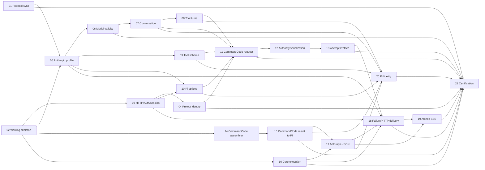

# LuckyToken Core Tickets Implementation Guide

本文说明如何实现 `.tickets` 中的 21 张 ticket。它不是新的 Architecture、Protocol 或 Conversion Spec；发生冲突时，权威顺序仍是：

```text
Protocol Spec
→ 定义单一 representation 的结构、语义和 lifecycle

Conversion Spec
→ 定义相邻 representation 的精确映射

LuckyToken Core Spec
→ 定义 ownership、dependency、information flow 和 lifetime
```

## 1. 当前基线

开始实现前固定以下证据：

| Contract | Reviewed baseline |
| --- | --- |
| LuckyToken Core | v5.5 |
| Anthropic Messages Protocol | v0.3，认证前仍需 Ticket 01 同步 |
| CommandCode Private Protocol | v1.3 / command-code 1.9.0 profile |
| Pi AI IR Protocol | v0.9.2 |
| Anthropic ↔ Pi Conversion | v1.1 / capability baseline v1 |
| Pi ↔ CommandCode Conversion | v0.20 |
| Pi reference package | `@earendil-works/pi-ai` 0.84.1 |

仓库目前只有规范与 Pi/Pi Agent 参考源码，没有 LuckyToken-owned 生产实现。因此 Ticket 02 同时承担 executable walking skeleton 和固定构建/测试命令的责任。

## 2. 不可破坏的设计约束

所有 ticket 都必须遵守：

1. Client Protocol 只理解 Client Wire ↔ Pi；CommandCode Provider 只理解 Pi ↔ CommandCode。
2. 不建立 Universal Request、Generic Message IR、Provider IR、Global Error IR 或 whole-request context bag。
3. `Model<Api> + Context + ModelsSimpleStreamOptions` 是唯一 Pi invocation。
4. Pi event stream 是 Execution state，不是 Anthropic renderer input。
5. Core v1 只有 atomic downstream commit；`stream=true` 只是 success wire representation。
6. Tool identity 由 ID 建立，partial tool input 永远不是 completed ToolCall。
7. EOF 不是 semantic success；成功必须来自显式 terminal。
8. HTTP-owned AbortSignal 在 success commit 前始终独立 authoritative。
9. Required-nullable target fields必须显式出现，不能用 omission 代替 `null`。
10. Unsupported semantics 必须显式失败，不能丢弃、文本化、猜测或依赖下游 repair。
11. Pi/Pi Agent reference tree 只用于核对和最小提取；不要引入 Agent、TUI、session、extension 或 tool-execution runtime。

## 3. 推荐的最小代码布局

Ticket 02 可以根据实际 package tooling 微调名字，但责任边界应保持如下：

```text
src/
├── runtime.ts                     # composition root only
├── router.ts                      # visible request orchestration
├── http.ts                        # transport lifecycle and final write
├── auth.ts                        # inbound authorization/session/project facts
├── model-resolution.ts            # selector + Models → Model<Api>
├── options.ts                     # composeOptions
├── execution.ts                   # Pi stream drain + atomic commit
│
├── protocols/
│   └── anthropic/
│       ├── profile.ts             # version/beta/semantic-header classification
│       ├── parse.ts               # JSON/body grammar detection
│       ├── conversation.ts        # source conversation validation/canonicalization
│       ├── validate.ts            # source validity
│       ├── representability.ts    # v1 support + Pi representability
│       ├── request.ts             # accepted request → Context/options/renderState
│       ├── messages.ts            # deterministic message conversion
│       ├── tools.ts               # tool definition/turn conversion
│       ├── schema.ts              # source validity + exact v1 subset
│       ├── response.ts            # AssistantMessage → Anthropic Message/JSON
│       ├── sse.ts                 # atomic SSE serializer if needed
│       └── types.ts               # Anthropic-private short-lived types only
│
└── providers/
    └── commandcode-private/
        ├── provider.ts            # Pi Provider + attempts/retry/cancellation
        ├── request.ts             # Pi → CommandCode request
        ├── response.ts            # JSONL assembler + CommandCodeResult → Pi
        └── project.ts             # projectDir → ServerConfig

test/
├── unit/
├── protocol/
├── conversion/
├── integration/
├── fixtures/
└── certification/
```

不要为布局对称而增加 Manager、Registry、Builder、Adapter framework 或 dependency container。普通函数、窄 module closure 和 request-local variables 足够。

## 4. 实施波次

只领取 blockers 已全部完成的 frontier ticket：

| Wave | Tickets | 可以并行的原因 |
| --- | --- | --- |
| 1 | 01, 02 | 协议同步与 walking skeleton 相互不阻塞 |
| 2 | 03, 05, 14, 16 | 分别处理 request edge、Anthropic ingress、CommandCode response、Core execution |
| 3 | 04, 06, 10 | project、model-aware validity、options 各有独立 owner |
| 4 | 07, 09 | conversation 与 tool definition/schema 可并行 |
| 5 | 08 | 在普通 conversation 之上增加 tool-turn hierarchy |
| 6 | 11 | 汇合全部 Pi → CommandCode request semantics |
| 7 | 12, 15 | request authority 与 committed response → Pi 可并行 |
| 8 | 13, 17 | physical attempt 与 Anthropic JSON response 可并行 |
| 9 | 18, 20 | delivery/failure 与 Pi fidelity closure 可并行 |
| 10 | 19 | 在 target Message 和 HTTP atomicity 上增加 Atomic SSE |
| 11 | 21 | 全部路径完成后才能认证 |

依赖图：



## 5. 每张 ticket 的实现方法

### 01 — Protocol synchronization

- 只修改 protocol/conversion/conformance authority，不扩大 v1 capability。
- 把 prefill validity 和 strict 20/24/16 rules 写到 Anthropic Protocol 的 owning sections。
- 更新 conversion dependency hash/revision，并增加 drift test。
- 不在 runtime code 中先写一套私有规则后让文档追随实现。

### 02 — Walking skeleton

- 选择最小 Node 22 + TypeScript setup，并固定 build、typecheck、test scripts。
- 使用真实 Pi public contracts 和可注入 fixture fetch；不要调用真实 CommandCode 网络。
- 第一条 golden path 只处理最小 user text、CommandCode text response 和 Anthropic JSON。
- 即使功能最小，也必须跨真实 HTTP/Protocol/Models/Provider/Execution/renderer boundaries。

### 03 — HTTP/Auth/session

- HTTP boundary 创建 request AbortController，并把 disconnect/timeout/shutdown 汇入它。
- Auth 用一个窄 `resolve(headers)` operation；header registry、token lookup、fallback generator 属于 bound dependencies。
- Auth 输出后销毁 raw credential state，只把 `sessionId/projectDir?` 传给 orchestration。
- 用 race fixtures 测 late terminal 和 closed response，不能只测 happy path。

### 04 — Project identity

- `projectDir` 是唯一 project identity；`config` 与 `x-project-slug` 在 Provider 中 late-create。
- Project Snapshot capability 内部拥有 filesystem/Git/date closure，Provider 不直接接收 primitives bag。
- project-less path必须完全不执行 filesystem/Git。
- snapshot 只在 logical invocation 执行一次；retry 复用 stable body。

### 05 — Anthropic ingress

- 按顺序实现：profile envelope → semantic-header classification → JSON syntax → grammar coverage → source validity → v1 support。
- 在 canonicalization 前保留需要识别的 presence bits，例如 explicit empty array。
- `InvalidRequest` 与 `UnsupportedFeature` 使用不同 constructors/results，不通过 message 文本重新分类。
- 保留 unknown Anthropic-owned marker 到 known source validity 已完成，避免 unsupported extension 掩盖 malformed request。

### 06 — Model resolution

- Resolver 只消费 selector 和 Pi Models，不读取 message/auth/project/provider wire。
- 成功后只传播 `Model<Api>`；selector parsing/candidates 到此死亡。
- 把 final-assistant prefill policy做成 Anthropic-owned窄函数，revision 进入 certification identity。
- representability check 发生在 Model 已知后、deterministic conversion 前。

### 07 — Conversation conversion

- 将 source validation/canonicalization 与 deterministic construction 分开。
- `receivedAt` 在 request edge 生成一次，用于所有缺失的 Pi historical timestamps。
- Synthetic history provenance 使用冻结常量；不得使用 resolved target identity。
- 为 `""`, whitespace, tabs, CR/LF 和相邻同 role 构造精确 fixtures。
- 不调用会改变已接受语义的 generic history repair helper，除非 Ticket 20 已证明 identity。

### 08 — Tool turns

- Source validation 使用 turn-scoped `Map<toolUseId, name>`；离开对应 turn 即销毁。
- Anthropic user tool-result turn先输出 Pi ToolResult messages，再输出 ordinary UserMessage。
- ToolResult string/empty-array policy必须读取 explicit source-profile authority，而不是根据 Pi shape 推断。
- Pi → CommandCode 的 missing-result synthesis是 concrete Provider rule，不能回流成为 Anthropic source repair。

### 09 — Tool schemas

- 实现两个 pure predicates：source-schema validity 与 frozen-subset support；不要合并 failure authority。
- 递归只进入 `properties.*`, `items`, schema-valued `additionalProperties`。
- strict counters 是 request-wide accumulator，而非逐 tool 检查。
- 先生成 truthful Pi `parameters/constrainedSampling`，runtime capability gate 后置。

### 10 — Options composition

- 显式逐字段构造 options；不要用多个不透明 object spread 决定 precedence。
- metadata 按 key merge，并为 `user_id/projectDir` 检查 non-owner collision。
- `signal` reference 写入后不可替换，但 signal state保持 live。
- 为 must-absent fields 写 negative tests，防止未来 Pi option 自动进入 v1。

### 11 — CommandCode request

- 直接从 Pi Model/Context/Options 构造 concrete CommandCode request。
- Headers 先处理 ordinary Pi header suppression，再移除 reserved names，最后 overlay Provider authority。
- Message/tool conversion保留 hierarchy；不要先 flatten 到 universal blocks。
- Reasoning 使用 Pi supported-level/clamp semantics和 frozen CommandCode mapping。
- 在进入 callback 前完成所有 Provider fact resolution和 authority capture。

### 12 — Authority and serialization

- Capture 分成 request-validation lifetime 与 response lifetime；二者死亡点不同。
- 对 callback-visible config 和 pricing tiers做 lossless clone/alias isolation。
- `onPayload` 只运行一次并且 abort-aware；retry 不回到 semantic preparation。
- `JSON.stringify` 只运行一次；对 parse-back validation value检查实际 wire semantics。
- validation success 后仅保留 body text、base headers、URL、fetch和logical trace state。

### 13 — Attempts and retry

- 每次 attempt创建 combined caller/timeout signal并在 finally 清理 listeners/timer/reader。
- timeout 覆盖 response body 完成，而不仅是 headers。
- `onResponse` 每个 physical Response 一次，且 cancellation winning 时取消 body。
- retry delay parser区分 malformed hint 与 successfully parsed but unacceptable delay。
- 为每个 retry assert stable body/session/config/traceId，以及 fresh span/decoder/assembler。

### 14 — CommandCode assembler

- Decoder 与 assembler 分开：前者只产出完整 raw line，后者验证 event/lifecycle。
- `slots[]`决定 start order；三个 maps只用于按 ID 找 state。
- finish 只更新 candidate；只有 EOF finalizer能 commit。
- 任何 failure 都丢弃 semantic staging；raw diagnostics可保留，但不参与转换。
- 重点使用 adversarial fixture：chunk split、UTF-8 split、interleaving、duplicate/missing lifecycle、multiple finish。

### 15 — CommandCode result to Pi

- Stage B先完成 usage，再完成 content；这决定 late content failure能否保留 trustworthy usage。
- Validate numeric categories before calculating cost，禁止 clamp/round。
- Final ToolUse input只来自 final tool-call，preview不能修复。
- Stage C只 replay final Pi message；不要重放 CommandCode physical deltas。
- `push(done/error)` 是 semantic/result terminal；`end()` 仅关闭 container。

### 16 — Core execution

- 通过 async iterator的 `next()` 与 AbortSignal 建立 request-local race。
- 必须观察 terminal event type；不能依赖 `.result()` 判断 success。
- terminal/message mismatch、unsupported deferred、observed terminal-less end均失败。
- Abort before commit wins；commit 后不再让 later disconnect改变 semantic result。
- 不为 malformed never-ending Provider增加 global watchdog；使用现有 timeout/abort policy提供 liveness。

### 17 — Anthropic JSON response

- 先执行 outbound fidelity assertion，再创建一次 target Anthropic Message。
- 对 ToolCall arguments进行递归 JSON-value validation，之后才编码。
- Required-nullable字段由 target schema builder显式填充。
- `renderState.clientModel` owns client-visible model；内部 Pi model/provider identity不泄漏。
- Termination mapping只能使用 certified semantic state，不能从 rawStopReason/errorMessage猜测。

### 18 — Failure and delivery

- 使用 boundary-specific typed failures；不需要一个 GlobalErrorIR。
- Renderer将 failure转换为完整 status/headers/body；HTTP boundary只机械写出。
- success body和 SSE frames完全生成后才设置成功 response。
- 用 injectable writer记录 byte count，验证任意中途失败都没有 partial success bytes。

### 19 — Atomic SSE

- Serializer 输入是 Ticket 17 构造的同一个 target Message，而不是 Pi events。
- 为每个 target content block生成完整合法 lifecycle；index等于 target array index。
- 建立 test-local protocol accumulator，分别验证 per-frame schema与 final semantic equality。
- 初始/terminal usage如何拆分必须来自 conformance evidence；在证据前不要固化方便的 `0` trajectory。
- 兼容性测试至少覆盖项目支持的 Anthropic SDK consumer版本。

### 20 — Pi fidelity closure

- 先判断当前 certified route是否真的经过风险代码；能通过不调用 lossy helper解决时，不要修改 Pi。
- 若 Pi public contract缺少必须语义，优先在 Pi owning type/adapter/runtime处做最小 coherent patch。
- 当前已审查风险包括：

  - simplified options可能 clamp `maxTokens`；
  - shared history transform可能插入 image placeholders、转换 thinking、normalize tool IDs和synthetic results；
  - existing Anthropic adapter过滤 whitespace、对 non-strict tools截断 schema、OAuth path注入 system identity；
  - generic lazy boundary可能丢失 AbortSignal provenance；
  - streaming JSON parser不强制 ToolCall root object；
  - target-visible termination/companion state可能在 Pi 中丢失。

- 不相关 built-in Provider path无需为了整洁而重写；certification绑定的是 concrete CommandCode route。
- 对任何 Pi patch保留 upstream provenance和独立 regression test。

### 21 — Runtime certification

- Manifest是 immutable identity集合，不是新的 runtime manager。
- certification runner使用与 production composition相同的 Provider construction、models和policy。
- 分别验证 readiness、invocation integrity、request-specific fidelity、execution、outbound fidelity和round trip。
- 任一 reachable semantic gap使结果为 `FAILED`；只有完整清单通过才能写 `CERTIFIED`。
- Serving只持有不含 Provider-registration mutation authority的 runtime view。

## 6. 测试分层

### Unit tests

适合 pure contracts：

```text
header/profile classification
schema predicates and counters
model selector parsing
message/tool conversion
option composition
project slug/config field rules
retry delay parsing
usage partition/pricing
target Message construction
```

### Protocol state-machine tests

使用 table-driven fixtures覆盖：

```text
known malformed vs unknown extension
start/delta/end ordering
interleaving
duplicate IDs
partial tool input
finish/error/abort/pause
EOF before terminal
multiple finish
required-nullable fields
SSE frame validity
```

### Integration tests

使用 injectable fixture transport，运行完整：

```text
Anthropic HTTP Request
→ Auth
→ Pi Models
→ CommandCode Provider
→ fixture JSONL
→ Pi stream
→ Core COMMIT
→ Anthropic JSON/SSE
```

Fixture transport必须允许控制：

```text
chunk boundaries
UTF-8 split
response timing
body stalls
abort timing
HTTP status/headers
retry sequence
callback timing/rejection
```

### Certification tests

Certification tests绑定 immutable revisions，并额外证明：

```text
no hidden semantic configuration
no Provider-registration mutation while serving
accepted max tokens/tool schemas/messages remain exact
tool-ID mapping collision-safe
termination reachability complete
JSON/SSE semantic equality
next-turn round-trip fidelity
in-flight request isolation
```

## 7. 每票完成检查

实现者在关闭任何 ticket 前应确认：

- 只修改该票拥有的 boundary，未顺手引入无关 refactor。
- Acceptance criteria逐项有测试或可复现实证。
- 新的重要 fact明确了 producer、carrier、semantic consumer、transparent transit和death point。
- 新 runtime dependency出现在 module bound dependency或operation input中，没有 ambient fourth source。
- Cancellation清理 request-local state并停止 later writes/terminals。
- 失败没有被伪造成 success，EOF没有被当作 semantic terminal。
- 已运行 Ticket 02 固定的 typecheck、unit、integration commands。
- 对 Pi reference/owned source的任何改动都有最小范围、provenance和回归测试。

## 8. 明确不在这些 tickets 中实现

除非产生新的已证明 requirement，不实现：

```text
live Pi token → downstream token forwarding
Pi deferred execution
Agent/session/tool-execution runtime
conversation persistence
Desktop/CLI/TUI product layer
generic Provider/Protocol IR
service locator/dependency bag
persistent credential/model store
universal retry/transport framework
future Anthropic beta profiles
server tools/thinking round trip
```

## 9. 开始方式

第一 frontier 是 Ticket 01 与 Ticket 02。建议先完成 Ticket 02 的 executable skeleton，使后续每张票都能沿同一真实路径增加一个可验证 semantic slice；Ticket 01 可并行同步认证依赖。之后严格按 blockers领取，不跳过失败-order、atomicity 或 certification工作。
