# LuckyToken 实现架构说明

**文档性质：** 当前实现的维护者地图（implementation architecture map）<br>
**对应代码：** `src/` Core 与 `packages/` Provider Package 生产路径，Node.js 22.19+，TypeScript，Pi AI 0.84.1<br>
**源码基线：** commit `41007a5`（2026-08-14，CommandCode Provider Package）<br>
**架构规范：** [LuckyToken Core Architecture Specification](./Spec/LuckyTokenCoreSpec.md)<br>
**设计约束：** [AGENTS.md](../AGENTS.md)

本文回答六个问题：LuckyToken 最终提供什么功能；一次请求如何完成；系统由哪些
模块构成；每个模块的接口、输入、输出和配套文件是什么；模块上下左右连接谁；
当前实现是否遵守高内聚、低耦合与信息生命周期原则。

本文以当前源码为准，不把未来计划写成已经实现的能力。Core Spec 定义规范性
架构，Protocol/Conversion 文档定义协议语义与映射；本文只负责把这些规则对应到
真实代码、真实文件和真实调用链。

文档章节：

1. 项目总功能与边界；
2. 总体模块图与完整流程；
3. Transport 与 Runtime；
4. Client Auth 与本地 token；
5. Anthropic Messages Client Protocol；
6. Pi Runtime、配置、Composition 与 CLI；
7. CommandCode Private Provider；
8. 持久文件、生成物与公共 API；
9. 全部生产模块索引；
10. 测试、Certification 与真实证据；
11. 对 `AGENTS.md` 的符合性审计；
12. 正确扩展方式；
13. 推荐阅读顺序。

## 零基础读者怎么使用本文

如果你没有编程经验，不需要先理解代码框中的英文。每章新增的“**小白导读**”和
“**小白理解**”是另一条独立阅读路线：先看生活类比，再看简图，最后只在需要核对
细节时阅读原有开发者内容。

先记住几个常用词：

| 术语 | 小白解释 |
| --- | --- |
| Agent | 你实际使用的 AI 软件，例如能写代码、聊天或调用工具的客户端 |
| API / endpoint | 软件之间约定好的“服务窗口”和地址；本项目当前窗口是 `/v1/messages` |
| Protocol | 双方说话必须遵守的格式和规则，类似表格模板或交通规则 |
| Token（本地认证） | Agent 进入 LuckyToken 的门票，不是模型输出消耗的 token 数量 |
| Provider | 真正连接外部模型服务的适配模块，类似负责向特定供应商下单的采购员 |
| Runtime | 请求正在处理时负责调度和控制生命周期的运行部分 |
| Pi / IR | 左右双方都能理解的中间语义，类似翻译工作中的“标准中间稿” |
| Stream | 内容分多段到达；本项目会先完整确认上游结果，再生成客户端 SSE |
| Composition | 程序启动时把各模块连接起来，类似开店前安排柜台、员工和钥匙 |

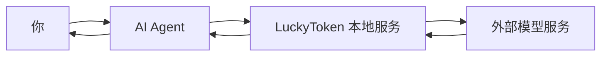

---

# 1. 项目总功能与边界

## 1.0 小白导读：LuckyToken 是什么

可以把 LuckyToken 想成一家“翻译兼转运服务”。Agent 按 Anthropic 或 OpenAI
Responses 格式下单，而当前外部模型服务使用 CommandCode 的格式。LuckyToken 不替模型思考，
只负责验票、翻译、转交、确认结果完整，再按 Agent 能理解的格式送回来。

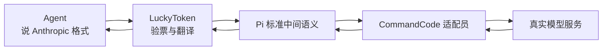

读完本章只需要判断两件事：项目今天确实能做什么，以及哪些能力只是未来可能增加，
不能因为架构图中出现名称就误认为已经实现。

## 1.1 当前对外功能

LuckyToken 当前是一个本地模型协议桥接服务。它在 loopback TCP 上提供 Anthropic
Messages 与 OpenAI Responses endpoints，让 Claude Code、Codex CLI 等 Agent 使用
各协议独立的本地 token 调用服务；服务把请求转换为 Pi AI runtime contract，再由
注册到 Pi `Models` 的 Provider 调用真实上游，最后把 Pi 结果重新渲染为对应协议的
JSON 或 Atomic SSE。`GET /v1/models` 还提供已加载 external Providers 的模型发现。

> **小白理解：** Agent 连接的是你电脑上的本地地址，但真正回答问题的是远端模型。
> LuckyToken 像中间服务台：Agent 不需要知道远端供应商的专用格式，远端供应商也不
> 需要知道客户端使用的是哪种 Agent。

当前完整路径是：

```text
Claude Code / Codex CLI
  POST /v1/messages or POST /v1/responses
        │
        ▼
Node HTTP adapter
        │ WHATWG Request / Response
        ▼
Runtime route selection
        │
        ▼
selected Client Protocol handler + its own Auth
        │ Model + Context + ModelsSimpleStreamOptions
        ▼
Pi Models / Pi AI IR
        │ Pi Provider contract
        ▼
CommandCode Private Provider
        │ HTTP + JSONL
        ▼
https://api.commandcode.ai/alpha/generate
```

反向结果路径是：

```text
CommandCode JSONL events
        │
        ▼
CommandCode content assembler / semantic converter
        │ AssistantMessageEventStream
        ▼
Pi execution consumer
        │ committed AssistantMessage
        ▼
selected Client Protocol renderer
        │ JSON or Atomic SSE bytes
        ▼
WHATWG Response → Node ServerResponse → Agent
```

当前已经实现的产品操作包括：

- 启动本地 Anthropic `/v1/messages`、OpenAI Responses `/v1/responses` 与
  model discovery `/v1/models` routes；
- 使用每个 Client Protocol 独立的 global/project token 认证本地 Agent；
- 把 project token 绑定的唯一绝对目录投影为 Pi
  `Options.metadata.projectDir`；
- 通过 Pi `Provider.auth` 接口执行 Provider login/logout，并把 credential 保存到
  Pi-owned `auth.json`；
- CommandCode Private Provider 作为私有 workspace package 从 `node_modules` 加载
  （模型与上游地址由包拥有，配置只需声明 package 根名）；
- 支持 `models.json` 注册用户自定义 Provider（`baseUrl` + `api` + `apiKey` +
  `models`），复用 Pi 内置 api adapter（如 `anthropic-messages`），经同一
  Anthropic endpoint 按 `provider/model_id` selector 访问；
- 支持 Anthropic text、history、thinking replay、tool call/tool result、JSON 与
  Atomic SSE；
- 支持 Responses incremental input、`previous_response_id` 的有界持久化展开、
  Responses JSON/Atomic SSE、Codex tool shapes 与 `store:false` policy；
- 支持 `output_config.effort` → Pi reasoning 映射、`metadata.user_id` 透传、
  `max_tokens=0` 保留；未知 effort 降级为 Pi reasoning default；
- 支持 Claude Code 等真实 Anthropic Agent 接入；recognized fields 按冻结转换方法
  直接转换或显式 omit/degrade，例如 `top_p` 与 thinking budget 进入 Pi，
  `tool_choice` 无 Pi 表示时不伪造控制；
- 支持请求超时、客户端断开、服务关闭、Provider retry 与取消传播；
- Provider 通过受信任的 neutral Pi diagnostic 提供有界 upstream failure facts；
  Execution 把已验证 fact 保存在 `ExecutionFailure.failure`，Anthropic/Responses
  renderer 只据此映射 status、safe message/type/code 与 allowlisted headers；没有
  structured fact 的 execution failure 固定返回 generic 502 `api_error` +
  `Upstream provider failed`，不暴露 Pi `errorMessage`；
- 用 serving certification 和真实在线 conformance 固定当前可服务组合。

## 1.2 当前没有实现的能力

> **小白理解：** 这一节相当于产品包装上的“暂不支持”。它防止我们把“设计上可以
> 扩展”误解为“今天打开软件就能使用”。

下列内容不能从现有架构图误读为已实现：

- TLS、公网暴露、反向代理配置、多租户或管理后台；
- Agent loop、工具实际执行或 TUI；
- `/health` 或除 `/v1/models` 外的其他未认证 endpoint；
- 跨 Client Protocol 共享本地 token；
- Provider Package 自动扫描/安装、热加载或插件市场；
- 把 Client Protocol 请求直接转换为 CommandCode 请求的旁路；
- 在 LuckyToken 中重新实现一套与 Pi 平行的通用 LLM IR。

以后增加新的 Client Protocol 时，应新增独立 route、handler、Auth snapshot、token
file、conversion tests 和一个 composition binding；不得修改现有 handler，也不得
修改 concrete Provider 来识别新 Client 术语。

## 1.3 第一原则：Pi 是唯一共享语义边界

> **小白理解：** 两侧翻译员不直接研究对方的语言。左边各 Client Protocol 只负责
> “自己的 wire → 标准中间稿”，右边只负责“标准中间稿 → CommandCode”。这样以后换掉任意
> 一边，另一边不用跟着重写。

系统的核心不是“Anthropic 转 CommandCode”，而是两条互相独立的转换：

```text
Client Wire ↔ Client Protocol adapter ↔ Pi
Pi ↔ Provider adapter ↔ Upstream Wire
```

因此：

- Anthropic 模块可以依赖 Pi types，但不能 import、命名或判断
  `commandcode-private`；
- CommandCode Provider 可以依赖 Pi types，但不能 import、命名或判断
  Anthropic/OpenAI Responses；
- Runtime 只认识 `Request`、`Response` 与 `ClientProtocolHandler`；
- composition root 可以同时看见 concrete handler 与 Provider，但只负责构造、
  注入和认证，不做协议转换；
- `sessionId`、`projectDir?`、`AbortSignal` 是窄 invocation facts，不是第二套通用
  request DTO。

这条边界使两侧可以分别扩展：增加 Client Protocol 不要求修改 Provider；增加
Provider 不要求修改 Client Protocol。

---

# 2. 总体模块图与完整流程

## 2.0 小白导读：一次请求要经过哪些岗位

LuckyToken 不是一个什么都做的巨大模块，而像一条有明确岗位的流水线：门卫检查
身份，分拣员选择窗口，翻译员整理内容，Pi 负责统一中间格式，Provider 联系供应商，
最后由原来的翻译员包装回复。

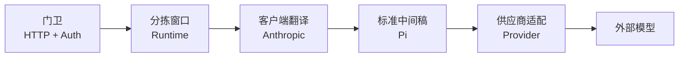

每个岗位只拿到完成任务必需的信息。例如门卫会看到门票，但模型不会；Provider 会
看到项目目录这个事实，但不会看到本地 token 文件。

## 2.1 五组生产模块

> **小白理解：** 表中的五组模块就是五个部门。判断设计是否清晰，可以看一个部门
> 是否偷偷做了另一个部门的工作。例如 HTTP 部门只搬运请求，不应理解工具调用或
> CommandCode 字段。

| 模块组 | 主要目录/文件 | 负责什么 | 明确不负责什么 |
| --- | --- | --- | --- |
| Transport/Runtime | `server.ts`, `runtime.ts`, `http.ts` | TCP、Node/Web 类型适配、route、取消、timeout、response delivery | Anthropic 字段、Pi message、Provider 配置 |
| Client Auth | `auth.ts`, `client-auth/` | inbound credential 解析、token authority、session/project fact | Client Wire、Pi credential、Provider auth |
| Anthropic adapter | `protocols/anthropic/` | Anthropic Wire ↔ Pi，Anthropic error/JSON/SSE | CommandCode 协议与 Provider 决策 |
| Pi integration/composition | `pi/`, `composition.ts`, `cli-config.ts`, `cli.ts` | 配置加载、Pi Models、Provider 注册、credential persistence、进程装配 | 两侧协议转换语义 |
| CommandCode Provider Package | `packages/provider-commandcode-private/` | Pi ↔ CommandCode、project snapshot、HTTP attempts、JSONL lifecycle | Anthropic/OpenAI 响应格式与 Core 注册策略 |

静态依赖方向如下。箭头表示“调用或持有”，不是数据在 wire 上的方向：

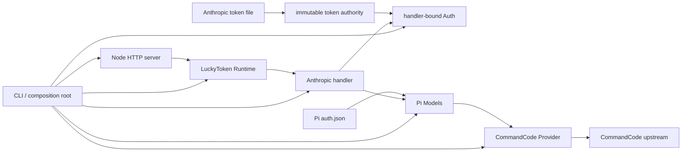

需要特别注意：图中没有 `Anthropic handler → CommandCode Provider`，也没有
`CommandCode Provider → Anthropic renderer`。二者唯一相遇的位置是 Pi public
contract 和启动期 composition/certification。

## 2.2 进程启动流程

> **小白理解：** 启动阶段类似开店前准备：读取地址和规则、准备每个窗口的门票名单、
> 载入可用模型、登录供应商、把员工安排到岗位。开门营业后，每位顾客的请求不再携带
> 整份配置文件到处传递。

CLI serve 路径只在启动期读取完整配置：

```text
--config path
  → loadLuckyTokenCliConfig()
  → frozen LuckyTokenCliConfig
       ├── server host/port
       ├── protocol id → authFile
       ├── pi.directory
       └── request limits

createConfiguredLuckyTokenComposition(config)
  ├── load selected protocol token file once
  │    └── immutable ClientTokenAuthority
  ├── construct Pi Models with CredentialStore(pi/auth.json)
  ├── register Pi builtins, then models.json providers
  ├── import configured Provider Packages from node_modules
  ├── validate/stage every Provider and atomically register them
  ├── leave Provider credential checks to the Pi invocation path
  ├── certify provider-neutral Core composition facts
  ├── construct generic Auth
  ├── construct Anthropic handler(models, auth)
  └── construct Runtime([handler])

startLuckyTokenHttpServer(runtime, host, port)
  └── print actual http://host:port/v1/messages
```

完整配置对象不会进入每次请求。Server 只得到 host/port/runtime；Auth 只得到
token lookup closure；Anthropic handler 只得到 `Models`、`Auth` 和自己的 limits；
Provider 只得到自己的 model、transport、project capability 与 clock/ID capability。

## 2.3 单次请求流程

> **小白理解：** 每一步都会把信息整理成下一步真正需要的样子，并丢掉旧包装。这样
> 后面的模块不必知道请求最初来自 Node socket、哪个 JSON 写法或哪种 token scope。

请求中的 ownership 依次变化：

```text
1. server.ts
   IncomingMessage + socket
   → WHATWG Request

2. http.ts / runtime.ts
   method + pathname
   → one ClientProtocolHandler

3. anthropic/handler.ts
   Headers → AuthResult
   raw JSON → validated Anthropic request
   model selector → Pi Model
   request semantics → Pi Context + protocol options

4. anthropic/options.ts
   protocol options
   + Auth sessionId/projectDir?
   + HTTP AbortSignal
   → ModelsSimpleStreamOptions

5. execution.ts / Pi Models
   Model + Context + Options
   → AssistantMessageEventStream
   → one supported done.message or failure

6. anthropic renderer
   AssistantMessage + protocol render state
   → exact Anthropic JSON or Atomic SSE bytes

7. server.ts
   WHATWG Response
   → ServerResponse status + headers + complete bytes
```

## 2.4 信息生命周期

> **小白理解：** “生命周期”就是一条信息从出现到销毁的旅程。门票只应在门口使用；
> 如果门票号码一路传到模型回复里，就是信息泄漏。下面的表专门检查每种信息应在哪一站
> 停止继续传播。

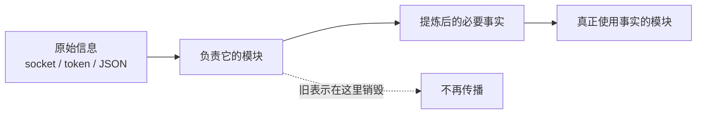

| 信息 | 产生位置 | 最远传播位置 | 死亡点 |
| --- | --- | --- | --- |
| Node socket / `IncomingMessage` | Node HTTP server | `server.ts` | Web `Request` 建立、response 完成或连接关闭 |
| raw client token | Anthropic request headers | generic `Auth.resolve()` | `AuthResult` 建立后 |
| global/project token 分类 | file-backed authority | authority lookup closure | 输出 `{ projectDir? }` 后 |
| token file JSON/path | startup/Client Auth capability | composition binding | immutable authority 建立后 |
| `sessionId` | Auth | Pi `Options.sessionId` / Provider invocation | Provider 不再需要 logical request identity |
| `projectDir` | project token authority | Pi `Options.metadata.projectDir` / interested Provider | Provider project representation 建立后 |
| Anthropic raw JSON | Anthropic handler | validation | validated source state 建立后 |
| Anthropic render state | Anthropic conversion | Anthropic renderer | response bytes 建立后 |
| Pi `Context` / `Options` | Anthropic adapter/options composer | Pi Models/Provider | Pi invocation terminal 后 |
| CommandCode request JSON | CommandCode Provider | upstream transport | transport 不再需要 body 后 |
| partial JSONL/tool state | CommandCode assembler | Provider stream | content completion、terminal、abort 或 error 后 |
| Anthropic 未转换字段（`top_p`、`thinking`、`context_management` 等） | Anthropic handler | 读取所需字段时 | 不进入任何 Pi 状态；在 validation 读取阶段即死亡 |
| CommandCode non-content 事件（`start`、`start-step`、`finish-step`、`provider-metadata`、`tool-result`） | CommandCode assembler | validate-then-drop；仅 finish-step last id/modelId 成为 response identity | committed result 建立前，其余 metadata/header/body 销毁 |
| CommandCode `providerExecuted`/`dynamic` 元数据 | CommandCode assembler | event 校验阶段 | committed response 建立前；不保留 |

这张表是判断“信息是否到处飞”的主要依据：一个模块可以透明传递 Pi contract
中的窄字段，但不应同时保留其旧 wire representation、文件 schema 或来源分类。

---

# 3. Transport 与 Runtime 模块

## 3.0 小白导读：把网络请求当成快递

这一章可以用快递系统理解。`server.ts` 是收发货车辆，负责真实网络连接；
`runtime.ts` 是分拨中心，保存有哪些服务窗口；`http.ts` 根据包裹上的“请求方法和
路径”把它送到正确窗口，并在客户取消、超时或关店时停止配送。

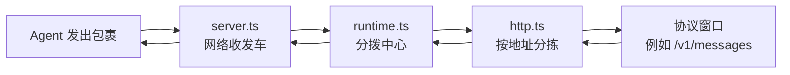

这三个模块只关心“包裹怎么安全送达”，不打开包裹研究 Anthropic、工具调用或模型
内容，所以将来换网络框架时不应影响业务翻译模块。

这一组只拥有 HTTP transport、route 和 request delivery lifecycle。它的共同边界是
Node 22 WHATWG `Request/Response`，不建立 LuckyToken 自定义 HTTP DTO。

## 3.1 Node HTTP adapter — `src/server.ts`

> **小白理解：** 这是唯一直接接触端口、网络连接和 socket 的模块。它像快递车，
> 负责把 Node 网络包裹换成项目统一使用的 `Request`，回来时再把 `Response` 原样
> 装车送走，但不会解读包裹里的业务内容。

| 项目 | 内容 |
| --- | --- |
| 功能 | 监听真实 TCP；在 Node HTTP types 与 WHATWG Web types 之间机械适配；管理连接断开和 server shutdown |
| 公共构造接口 | `startLuckyTokenHttpServer(options): Promise<RunningLuckyTokenHttpServer>` |
| 输入 | `{ runtime: LuckyTokenRuntime, host?: string, port?: number }` |
| 输出 | `{ host, port, origin, close(): Promise<void> }` |
| 默认值 | host=`127.0.0.1`，port=`3000`；port=`0` 时由 OS 选择测试端口 |
| 持有状态 | Node `Server`、当前实际 origin、活动 request 的 `AbortController` 与 `ServerResponse` set、幂等 close promise |
| 配套文件 | 无；host/port 由 composition/CLI 从 `.luckytoken/config.json` 投影进来 |
| 谁使用它 | CLI serve、程序化调用者、真实 TCP integration/online tests |
| 它使用谁 | Node `http`/`stream`；唯一业务依赖是 `LuckyTokenRuntime.handle(Request)` |

核心接口：

```ts
interface LuckyTokenRuntime {
  handle(request: Request): Promise<Response>;
}

interface LuckyTokenHttpServerOptions {
  runtime: LuckyTokenRuntime;
  host?: string;
  port?: number;
}
```

机械传输规则：

- URL 的 authority 来自实际绑定的 `origin`，不把客户端 `Host` 当作 route authority；
- `IncomingMessage` body 通过 `Readable.toWeb()` 进入 Web `Request`；
- Web `Response` 的 status、headers 和完整 body bytes 写入 `ServerResponse`；
- 客户端 request abort、response socket 提前关闭、server `close()` 都 abort 当前
  request signal；
- `close()` 停止新连接、abort/销毁活动响应，并且幂等；
- adapter catch 到未处理错误时只产生 transport-level 500，不解释 Anthropic 或
  Provider error。

边界判断：删除 `server.ts` 并换成其他 Web `Request/Response` host，不应修改
Anthropic、Pi 或 Provider 模块。

## 3.2 Runtime facade — `src/runtime.ts`

> **小白理解：** Runtime 像一张冻结的服务窗口清单。它知道“哪个地址由哪个窗口
> 处理”，但不知道窗口内部如何验票、翻译或联系模型。冻结清单能防止营业期间有人
> 悄悄换掉窗口规则。

| 项目 | 内容 |
| --- | --- |
| 功能 | 把一组独立 `ClientProtocolHandler` 冻结为稳定 route table，并暴露唯一 `handle(Request)` 接口 |
| 公共构造接口 | `createLuckyTokenRuntime(options): LuckyTokenRuntime` |
| 输入 | handlers、可选 request timeout、可选进程 shutdown signal |
| 输出 | frozen `{ handle(request): Promise<Response> }` |
| 持有状态 | frozen handler snapshots 和 HTTP lifecycle dependencies |
| 配套文件 | 无 |
| 谁使用它 | Node HTTP adapter；程序化调用者也可直接传 WHATWG `Request` |
| 它使用谁 | `http.ts` 的 `handleHttpRequest()` |

Runtime 构造时检查每个 route 有 method、absolute pathname，并拒绝重复
`method + pathname`。它保存 handler 的 method/path/handle snapshot，因此 serving
期间修改原始 handler object 不会改变 route table。

Runtime 不知道：

```text
Anthropic request schema
Auth file path or token scope
Pi Context / Model
CommandCode Provider
Node socket / port
```

## 3.3 HTTP request lifecycle/router — `src/http.ts`

> **小白理解：** Router 是分拣员。它只看 `POST` 和 `/v1/messages` 这样的地址，
> 找不到窗口就回答 404；客户挂断、等待太久或系统关机时，它会立即给整条处理链发出
> “停止”信号，并阻止迟到的结果再次送达。

公共相邻接口是：

```ts
interface ClientProtocolHandler {
  readonly method: string;
  readonly pathname: string;
  handle(request: Request): Promise<Response>;
}
```

| 项目 | 内容 |
| --- | --- |
| 功能 | exact method/path route；合并连接、shutdown、timeout cancellation；保证 response 只交付一次 |
| 输入 | frozen handler list、request timeout、shutdown signal、单个 WHATWG `Request` |
| 输出 | handler 的 WHATWG `Response`、404、generic 500，或 abort error |
| Request-local state | composite `AbortController`、writable/delivered flags、timeout timer、signal listeners |
| 谁使用它 | `runtime.ts` |
| 它使用谁 | 被选中的 `ClientProtocolHandler`；不使用 Auth、Pi 或 Provider |

选择顺序是先 route，后进入 handler。未来 `/v1/responses` 的 token 不可能在
Runtime 中被误送进 Anthropic Auth，因为 Runtime 先用 `POST + pathname` 选择一个
具体 handler，而 Auth 已经封装在该 handler 内。

失败语义：

- 没有 route：404；
- handler 抛出普通未分类错误：generic 500；
- request/shutdown/timeout abort：抛出 `HttpRequestAbortedError`，禁止交付 later
  response；
- response 已标记 delivered 后不能第二次 commit。

## 3.4 Transport/Runtime 的左右上下关系

> **小白理解：** 下图里只有协议窗口会理解业务内容。左边的网络层和中间的路由层
> 都只搬运标准 `Request/Response`，因此它们不会把 Anthropic 与某个 Provider 绑死。


- 上层构造者：CLI/composition 或程序化调用者；
- 左侧 caller：Agent/socket；
- 右侧 callee：一个已注册 handler；
- 下层基础设施：Node HTTP/stream；
- 该组对 Client Protocol 唯一要求：实现三字段接口，不泄漏 concrete protocol。

---

# 4. Client Auth 与本地 Client Token 模块

## 4.0 小白导读：门卡、访客编号与项目房间

Client Auth 可以想成酒店门禁。Agent 带着门卡来访问 LuckyToken；门卫验证门卡后，
只告诉后续模块“允许进入、这次访客编号是什么、是否绑定某个项目房间”。后续模块
不会拿到门卡原文或门卡名单。

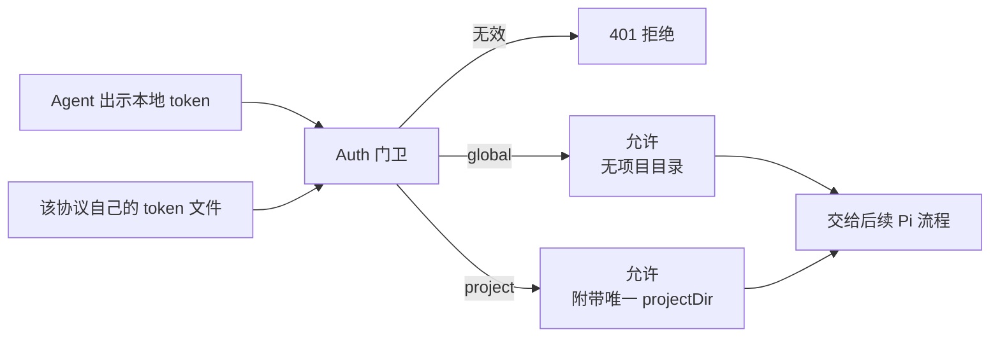

这里的门卡只负责“Agent 进入 LuckyToken”。LuckyToken 登录外部 CommandCode 的 API
key 是另一套供应商凭证，保存在另一个文件中，不能混在一起。

本组认证的是“Agent 是否可以调用 LuckyToken”，不是 LuckyToken 如何登录
CommandCode。两类 credential 分别落在不同文件、不同 runtime contract 中。

## 4.1 Generic inbound Auth — `src/auth.ts`

> **小白理解：** 通用 Auth 像统一门卫工作手册：从请求中取门卡、查询是否有效、
> 给本次访问分配一个 sessionId。它不关心这是 Anthropic 还是未来 OpenAI 窗口，
> 因为每个窗口在开门前已经拿到了自己的独立门卡名单。

```ts
interface Auth {
  resolve(headers: ReadonlyHeaders): Promise<AuthResult>;
}

type AuthResult =
  | { authorized: false }
  | { authorized: true; sessionId: string; projectDir?: string };

interface AuthDependencies {
  authorizeToken(token: string): AuthorizedClient | undefined | Promise<...>;
  createFallbackSessionId(): string;
}
```

| 项目 | 内容 |
| --- | --- |
| 功能 | 从 headers 提取一种 client credential；调用注入的 authority；规范化 session identity；只返回窄请求事实 |
| 输入 | 只读 headers view |
| 输出 | denied，或 `{ authorized, sessionId, projectDir? }` |
| 持有状态 | bound token-authorize function 和 fallback-ID generator；无 token store、无 protocol ID |
| 配套文件 | 无；文件由具体 authority capability 拥有 |
| 谁使用它 | 当前是 Anthropic handler；未来每个 Client Protocol handler 应得到自己的 `Auth` instance |
| 它使用谁 | 注入的 `authorizeToken` 和 ID generator |

Credential 支持 `Authorization: Bearer ...` 与官方 Anthropic SDK 使用的
`x-api-key`。两者同时存在且值不一致时直接 denied。Session header precedence 是
`x-session-id` 高于 `x-client-request-id`；只接受 UUID-shaped identity，否则生成
request-local fallback UUID。

Auth 完成后不输出 raw token、header source、global/project 分类或 file path。
Global authority 返回空 `AuthorizedClient`，最终 `AuthResult` 没有 `projectDir`；
project authority 只返回唯一绑定的 `projectDir`。

## 4.2 File-backed token authority/admin store — `src/client-auth/file-token-store.ts`

> **小白理解：** 同一个文件提供“保安查卡”和“管理员改卡”两种服务，但两种权限
> 分开。营业中的保安只能查，不能增删；CLI 管理员可以增删轮换，但不能直接改变已经
> 启动的保安手中快照，所以修改后要重启。

这个文件在同一个 capability owner 内提供两个刻意分开的窄接口：

```ts
loadFileClientTokenAuthority(path): Promise<ClientTokenAuthority>

interface ClientTokenAuthority {
  authorize(token: string): AuthorizedClient | undefined;
}

createFileClientTokenStore(options): FileClientTokenStore

interface FileClientTokenStore {
  create(scope, token?): Promise<string>;
  rotate(scope, token?): Promise<string>;
  remove(scope): Promise<boolean>;
  list(): Promise<readonly ClientTokenScope[]>;
}
```

第一条接口给 composition/runtime 使用，只暴露 immutable lookup closure；第二条给
administrative CLI 使用，只暴露 scope mutation，不暴露 runtime authority。这避免
composition 拿到不需要的 mutation capability，也避免 CLI 持有 serving snapshot。

持久文件严格为：

```json
{
  "schemaVersion": "luckytoken-client-auth-v1",
  "global": null,
  "projects": {
    "D:\\absolute\\normalized\\project": "project-token"
  }
}
```

| 项目 | 内容 |
| --- | --- |
| 文件 owner | Client Auth file capability |
| 文件选择者 | composition root 用 config 中的 protocol ID 把某个文件绑定到某个 handler |
| 文件内没有什么 | protocol ID、Anthropic/OpenAI 字段、Pi state、Provider credential |
| runtime representation | frozen token → `AuthorizedClient` lookup；文件 JSON 和 path 不传播 |
| administrative representation | global/project `ClientTokenScope`；`list()` 不返回 token value |
| token 规则 | 非空、无 whitespace、同一文件内不得绑定多个 scope；自动 token 为 256-bit random base64url |
| project 规则 | key 必须是已经 normalized 的绝对路径 |
| 权限 | 创建目录请求 0700、文件请求 0600（最终效果受 OS 能力影响） |

缺失、坏 JSON、未知字段、错误 schema、空 authority、重复 token、relative/aliased
project path 都在 authority 建立前 fail closed。启动时只加载一次；CLI 后续修改文件
不会改变已经运行的 snapshot，重启才生效。

本 capability 明确按非并发管理操作设计；它没有 watcher 或 client-token lock
manager。不同 Client Protocol 文件不跨读、不跨查 token。

## 4.3 Client token CLI capability — `src/client-auth/cli.ts`

> **小白理解：** 这是门卡管理柜台。`create` 发新卡，`rotate` 换卡，`remove` 注销，
> `list` 只列出有哪些卡位而不显示卡号。它一次只管理用户明确指定的协议文件，不会
> 搜索其他协议的门卡。

| 项目 | 内容 |
| --- | --- |
| 功能 | parse `client-token create/rotate/remove/list`；把 scope mutation 委托给 store；格式化安全输出 |
| 输入 | CLI args；注入的 `resolveAuthFile(configPath, protocolId)` |
| 输出 | success/error text；仅自动生成 token 时打印 token value |
| 配套文件 | 被 resolver 选中的一个 protocol token file |
| 谁使用它 | top-level `cli.ts` |
| 它使用谁 | `FileClientTokenStore`、project directory `stat()` |

`client-auth/cli.ts` 不 import 完整 application config loader。Top-level CLI 解析配置并
只把 `authFile` 这个窄事实返回给它。Project create 要求目录当时存在且确实为目录；
relative project 参数按 CLI 当前 working directory 解析为绝对路径。Mutation 成功后
明确提示 restart required。

## 4.4 每协议隔离的装配关系

> **小白理解：** 可以把 Anthropic 和未来 OpenAI 看成两扇不同的门。即使某张卡能
> 打开 OpenAI 门，也不能用来打开 Anthropic 门。只有启动时的总装配人员知道哪份
> 门卡名单交给哪扇门，普通请求处理过程不再讨论协议名称。

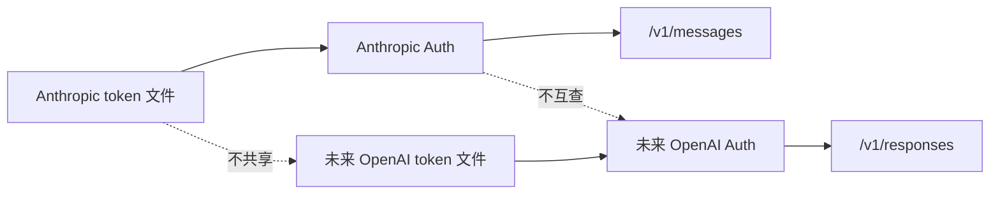

```text
.luckytoken/config.json
  clientProtocols[protocolId].authFile
        │                    startup only
        ▼
composition root
        │ loads exactly one file for one installed handler
        ▼
ClientTokenAuthority.authorize(token)
        │
        ▼
generic Auth.resolve(headers)
        │
        ▼
handler-local AuthResult { sessionId, projectDir? }
```

Anthropic token 即使在另一个协议文件中有效，只要没有存在于 Anthropic handler
绑定的 authority，就必须得到 401。Runtime、Pi 与 Provider 都不进行跨协议 token
搜索。

---

# 5. Anthropic Messages Client Protocol 模块

## 5.0 小白导读：这是“Anthropic 语言翻译部”

假设 Agent 只会按照 Anthropic Messages 的表格办事，而后面的 Pi 只接受自己统一的
内部表格。本章这些模块合起来就是一个翻译部：先检查来件是否完整、门票是否有效，
再把内容翻译成 Pi 能理解的形式；模型完成工作后，它又把结果翻译回 Anthropic
格式。它不需要知道最后是哪一家 Provider 真正回答了问题。


可以把这一章理解成一条有质检的翻译流水线。每个小模块只负责一道工序，所以未来
增加另一种 Client Protocol 时，不必修改这里来迁就它。

目录 `src/protocols/anthropic/` 是一个完整的 Client Wire ↔ Pi capability。它拥有
Anthropic headers/body 的合法性、Anthropic 到 Pi 的确定性转换、request-local
render state、Pi committed result 到 Anthropic target 的转换，以及 JSON/SSE wire
rendering。它不拥有 Provider 选择之外的任何 upstream 语义。

## 5.1 Handler/orchestrator — `handler.ts`

> **小白理解：** Handler 像翻译部的值班主管。它不亲自完成所有细节，而是严格按
> 顺序把来件交给门卫、表格检查员、翻译员、Pi 和包装员。顺序固定可以避免“还没
> 验证门票就开始工作”或“拿半成品当最终答案”这类问题。

```ts
interface AnthropicMessagesHandlerOptions {
  models: Models;
  auth: Auth;
  modelValidityPolicy?: AnthropicModelValidityPolicy;
  createMessageId?: () => string;
  maxRequestBytes?: number;
  routerDefaults?: RouterOptionDefaults;
  now?: () => number;
}

createAnthropicMessagesHandler(options): ClientProtocolHandler
```

输出 handler 固定为：

```text
method   = POST
pathname = /v1/messages
handle   = Request → Promise<Response>
```

| 项目 | 内容 |
| --- | --- |
| 功能 | 按固定顺序编排 Anthropic request 的 Auth、profile、body、model、conversion、Pi execution 和 rendering |
| 输入 | WHATWG `Request`；构造期注入的 `Models`、独立 `Auth`、policy/limits/clock/ID capabilities |
| 输出 | Anthropic JSON/SSE `Response`；连接级 abort 继续向外抛 |
| 持有状态 | frozen dependency snapshot；无跨请求 message/session store |
| 配套文件 | 无直接文件 I/O；token/model/credential 文件已在 composition 阶段变成窄 runtime capabilities |
| 谁使用它 | Runtime route table |
| 它使用谁 | 本目录所有 parsing/conversion/rendering 模块；generic Auth、model resolution、execution、Pi Models |

固定处理顺序是：

```text
Content-Type check
→ handler-bound Auth.resolve(headers)
→ Anthropic source profile
→ bounded raw-body read + JSON parse
→ model-independent request validation
→ resolve Pi Model
→ model-aware validity
→ Anthropic → Pi conversion
→ compose infrastructure facts into Pi options
→ freeze invocation
→ execute Pi stream to semantic terminal
→ Pi AssistantMessage → Anthropic target
→ JSON or Atomic SSE bytes
```

这个顺序很重要：authorization 不参与 Anthropic source-validity judgment；model-aware
检查在确定性 conversion 之前完成；renderer 只接收 committed
`AssistantMessage`，不会把 partial Pi stream 暴露成客户端成功。

## 5.2 Protocol profile — `profile.ts`

> **小白理解：** Profile 是“版本检查员”。Anthropic 请求会声明自己遵循哪个版本、
> 也可能携带实验或 SDK headers。LuckyToken 这里只核对版本；遇到陌生版本会拒绝，
> 其他 headers 不分类、不传播，也不影响协议转换。

| 项目 | 内容 |
| --- | --- |
| 接口 | `resolveAnthropicSourceProfile(headers)`；`assertImplementedAnthropicProfile(profile)` |
| 输入 | Anthropic-related header view |
| 输出 | `{ version }` |
| 当前支持 | `anthropic-version=2023-06-01`；其他 headers 不参与协议转换判断 |
| 谁使用它 | Anthropic handler/request validator |
| 它使用谁 | 只使用 Anthropic error classes |

它只读取 `anthropic-version`。`anthropic-beta`、其他 `anthropic-*`、Agent/SDK 与
transport headers 均不分类、不传播，也不参与 Anthropic → Pi 转换判断。

## 5.3 Request validation/conversion — `request.ts`

> **小白理解：** 这里先像办事大厅一样检查表格，再像翻译员一样转换表格。检查阶段
> 判断字段是否正确、前后关系是否成立；转换阶段只处理已经合格的内容。它不会擅自
> 补写缺失的工具调用，也不会把客户填写的模型名称塞进模型可见的对话正文。

主要接口分成两个阶段：

```ts
validateAnthropicSourceRequest(value)
  → ValidatedAnthropicSourceRequest

convertValidatedAnthropicRequest(validated, receivedAt)
  → AnthropicInvocation
```

`AnthropicInvocation` 是该 Client Protocol 的短生命周期输出，不是新的通用 IR：

```ts
interface AnthropicInvocation {
  selector: string;
  context: Pi.Context;
  options: Pi.ModelsSimpleStreamOptions;
  renderState: { clientModel: string; stream: boolean };
}
```

| 阶段 | 输入 | 输出 | 死亡的信息 |
| --- | --- | --- | --- |
| Grammar/source validation | unknown JSON body | validated Anthropic-owned state | raw JSON shape errors/unsupported list |
| Canonicalization | string/block message forms | module-private canonical content | shorthand/adjacent same-role wire spelling |
| Pi conversion | validated supported state | Pi `Context`, protocol-owned options, minimal render state | canonical Anthropic representation |

当前 accepted deterministic surface 包括 text、system prompt、历史 ordinary thinking、
base64 image shape、client tool definition、tool use/result、temperature、
`output_config.effort`、`metadata.user_id` 和 stream flag；但 image 还必须通过
model-aware fidelity policy，production 默认 policy 当前不认证 image path，因此
不会仅凭 JSON shape 放行。

**只转换指定字段，其他一律忽略。** 这是本模块的第一原则：conversion 只读取
Part II 1-7 章定义的字段（`model`、`system`、`messages`、`tools`、`max_tokens`、
`temperature`、`output_config.effort`、`metadata.user_id`、`stream`），其他任何
字段（`top_p`、`top_k`、`thinking`、`tool_choice`、`stop_sequences`、
`cache_control`、`context_management` 以及未来未知字段）直接忽略，不报错、不进入
Pi 状态。转换器不维护"已知 vs 未知"字段清单——它只关心自己需要的字段，读不到/
读坏了才报错。同理，message 的额外字段、content block 的额外字段（如
`cache_control`、`citations`、`caller`）、tool definition 的额外控制字段
（`type`、`allowed_callers`、`defer_loading` 等）都忽略。

**只有真正转换不了才报错。** 错误分类只有两类：

- `InvalidRequest`：转换需要的字段 malformed（如 `messages` 不是数组、
  `output_config.effort` 不是 string、`tool_use.input` 不是对象）；
- `UnsupportedFeature`：源语义有效但 Pi 无 faithful 表示且丢弃会改变请求意义
  （如 URL image source、未知 content block type、不在支持集合的 image
  media type）。

`output_config.effort` 的五个已知值（`low/medium/high/xhigh/max`）映射到 Pi
`ThinkingLevel`；**未知 effort 值降级为不设置 `reasoning`**（使用 Pi reasoning
default behavior），绝不让 request 因 effort 失败，也不强转为已知 level。

重要 conversation 规则：

- adjacent same-role Anthropic messages 在 module-private canonicalization 中合并；
- historical assistant message 变成 Pi `AssistantMessage`，使用保留的 synthetic
  provider/api identity，不冒充真实 Provider output；
- `thinking + signature` 变成 Pi `ThinkingContent + thinkingSignature`；
- `redacted_thinking + data` 变成 Pi `ThinkingContent { thinking: "", redacted: true }`，
  signature 携带 opaque data；
- assistant `tool_use` 变成 Pi `ToolCall`，ID/name/arguments 精确保留；
- immediately following user `tool_result` 变成 Pi `ToolResultMessage`，通过
  `tool_use_id` 查回 tool name；
- tool results 必须领先该 user turn 的 ordinary content，不能 orphan、duplicate 或
  延迟到后续 turn；
- 空 content 数组（`content: []`）是合法输入，构造 Pi `UserMessage { content: [] }`；
- `max_tokens=0` 原样保留为 `maxTokens=0`，不 clamp 不拒绝；
- source-invalid lifecycle 直接失败，converter 不猜测或修复；
- `renderState.clientModel` 保留客户端请求中的 model identity，response 时使用，但
  不进入 Pi model-visible context。

## 5.4 Client tools conversion — `tools.ts`

> **小白理解：** Agent 不只会聊天，也可能递交一张“可使用工具说明书”。这里检查
> 工具名称、参数表和约束，再把说明书原样含义地交给 Pi。它不会把结构化说明书压成
> 一段随意文字，因此工具名称、参数和严格约束不会在途中丢失。

```ts
validateAnthropicTools(value)
  → ValidatedAnthropicTool[] | undefined

convertAnthropicTools(validated)
  → Pi.Tool[] | undefined
```

| 项目 | 内容 |
| --- | --- |
| 功能 | 验证 client tool identity、strict flag 和 strict 计数；转换为 Pi `Tool` |
| 输入 | Anthropic `tools[]` unknown JSON |
| 输出 | name/description/inputSchema/strict validated state，再到 Pi tool definitions |
| 持有状态 | 仅一次 validation traversal 的 cycle set 与 strict request-wide counters |
| 谁使用它 | `request.ts` |
| 它使用谁 | Pi `Tool` type；Anthropic `InvalidRequest` |

它保留 tool name 和 schema，不把 schema stringify 成 prompt。`strict:true` 转成 Pi
`constrainedSampling = { type: "json_schema", strict: "require" }`。

**`input_schema` 直接传递，不做 JSON Schema keyword 校验。** conversion 不 rewrite、
normalize、reconstruct schema，也不重新实现 JSON Schema keyword validation
（转换文档 §5）。`$schema`、`anyOf`、`oneOf`、`format`、type array、未知 keyword
等全部原样传给 Pi `Tool.parameters`。工具定义中未转换的额外控制字段（`type`、
`cache_control`、`allowed_callers`、`defer_loading`、`eager_input_streaming`、
`input_examples`）按"只读所需"原则忽略，不报错。

唯一保留的 schema 解析是**协议层 strict 源有效性计数**（协议文档 §5.2.3）：
最多 20 个 strict tools、24 个 optional parameters、16 个 union parameters，
request-wide 累计。这个计数需要解析 `properties`/`required`/`type`，但只计数、
不拒绝未知 keyword。malformed 结构（如 `properties` 不是对象、`required` 不是
string 数组）仍是 `InvalidRequest`。

## 5.5 Model-aware representability — `representability.ts`

> **小白理解：** 请求语法正确，不代表选中的模型真的能完成它。例如表格可以正确
> 填写“发送图片”，但某个模型未必可靠支持图片。这里就是开工前的能力复核；无法
> 确认时宁可明确拒绝，也不假装支持。

```ts
interface AnthropicModelValidityPolicy {
  revision: string;
  classifyFinalAssistantPrefill(model, sourceProfile):
    "allowed" | "forbidden" | "unknown";
  hasCertifiedImageFidelity(model): boolean;
}
```

此 policy 只补足 Pi `Model` 没有表达的 Anthropic source-validity facts，不能演变成
通用 capability registry。当前检查：

- image 同时要求 Pi model 声明 `input: image` 和 policy 认证 fidelity；
- final-assistant prefill 即使 source-valid，也仍超出当前 LuckyToken v1；unknown
  不能猜测放行；
- historical thinking 要求 resolved model `reasoning=true`。

谁使用：handler 在 model resolution 后调用。它使用：validated Anthropic facts、
Pi `Model` 和 source profile。Provider 不参与这一步。

## 5.6 Pi options composition — `options.ts`

> **小白理解：** 一次任务的控制信息来自几个不同岗位：客户决定最大输出和温度，
> Auth 决定会话与项目目录，网络层提供取消信号。这里像一个有固定格子的汇总单，
> 每个岗位只能填写自己负责的格子，不能覆盖别人的信息。

```ts
composeOptions(
  protocolOptions,
  { sessionId, signal, projectDir? },
  routerDefaults,
): ModelsSimpleStreamOptions
```

这是不同 owner 的窄 facts 唯一汇合点：

| Fact owner | 输入字段 | Pi carrier |
| --- | --- | --- |
| Anthropic protocol | `maxTokens`, `temperature?`, `reasoning?`, `metadata.user_id?` | 对应 Pi option |
| Auth | `sessionId`, `projectDir?` | `sessionId`, `metadata.projectDir?` |
| HTTP lifecycle | `AbortSignal` | `signal` |
| Router | 当前必须为空的 classified defaults | 当前不产生 option |

它使用 closed-world allowlist 防止某一 owner 覆盖另一 owner 的字段。特别是 Anthropic
request 不能制造 `projectDir`，Router defaults 不能覆盖 `user_id/projectDir`。输出
建立后，各输入来源分类结束，只剩 Pi options fields。

Anthropic protocol 现在拥有的 Pi option keys 为：`maxTokens`、`temperature`、
`reasoning`、`metadata`（其下仅 `user_id`）。`reasoning` 来自
`output_config.effort` 的映射；Router defaults 不能注入 `reasoning`（它不属于
Router 的已分类 v1 policy）。

## 5.7 Model resolution — `src/model-resolution.ts`

> **小白理解：** Agent 写下一个模型名称后，这里负责在 Pi 的模型目录中找到唯一
> 对应项，类似用“厂商/商品编号”查目录。找不到或同名商品不止一个时就明确报错，
> 不会私自挑一家 Provider。

```ts
resolveModel(models, selector): Model<string>
```

先匹配 qualified `provider/id`，再匹配唯一 unqualified `id`；unknown 或 ambiguous
都抛 `ModelResolutionFailure`。它只依赖 Pi `Models.getModels()`，不读取
`models.json`，也不知道当前 Provider 是 CommandCode。Anthropic handler 使用它把
external selector 变成真实 Pi `Model`；404 rendering 由 handler 拥有。

## 5.8 Pi execution commit — `src/execution.ts`

> **小白理解：** 模型回答可能像连续寄来的多页传真。这里会一直等待 Pi 发出正式的
> “完成章”，并核对完成原因；仅仅传真机不再出纸（EOF）不等于任务成功。取消或
> 中途报错时，已经收到的半页内容会被丢弃，绝不包装成成功回答。

```ts
freezePiInvocation(model, context, options): void

execute(models, model, context, options): Promise<AssistantMessage>
```

`freezePiInvocation` 深冻 plain invocation data，但不冻结 live `AbortSignal`。
`execute` 主动消费 `Models.streamSimple()`：

- EOF 不是 success；没有 semantic terminal 的 EOF 是 malformed stream；
- `done(stop|length|toolUse)` 且 terminal reason 与 message 一致才 commit；
- `deferred` 当前不支持；
- `error/aborted` 分别成为 execution failure/abort；
- request signal 可以在 iterator wait 期间独立中止；
- partial content 从不作为成功返回。

该模块只认识 Pi event lifecycle，不知道 Anthropic JSON 或 CommandCode JSONL。当前
Anthropic handler 是它的 caller；任何未来 Client Protocol 也可复用它。

## 5.9 Pi result → Anthropic target — `response.ts`

> **小白理解：** 这是返程翻译员。它只接收已经盖过“完整完成章”的 Pi 结果，把正文、
> 思考、工具调用、停止原因和用量逐项翻译回 Anthropic 的表格。不能无损翻译的内容
> 会报错，不会静默删掉。

```ts
convertAssistantMessageToAnthropic(message, clientModel, messageId)
  → AnthropicResponseMessage
```

输入必须是已经 committed 的 Pi `AssistantMessage`。转换规则：

- Pi text → Anthropic text block；
- Pi ordinary thinking → Anthropic thinking + signature；redacted thinking fail closed；
- Pi toolCall → direct Anthropic `tool_use`，ID/name/JSON arguments 保留；
- `stop`/`length`/`toolUse` → `end_turn`/`max_tokens`/`tool_use`；
- Pi usage → Anthropic required usage shape，包括 cache/reasoning breakdown；
- response `model` 使用 request-local `clientModel`，不泄漏 Provider response model；
- unclassified Pi message/content/usage fields、非 lossless JSON tool arguments、非法
  count 全部抛 `OutboundResponseFidelityFailure`。

## 5.10 Exact JSON wire — `wire.ts`

> **小白理解：** 翻译好的答案还是一份内部对象，这里负责最后装箱成网络上真正发送
> 的字节。它再次核对箱内字段，并制作标准的成功或错误信封；它不再参与模型执行。

```ts
renderAnthropicJsonSuccess(target): PreparedHttpResponse
renderAnthropicError(status, type, message): PreparedHttpResponse
```

`PreparedHttpResponse = { status, contentType, body: Uint8Array }`。Success renderer
先按 exact field set 重新验证 target，再 UTF-8 JSON encode。Error renderer 只产生
Anthropic error envelope。`wire.ts` 是 bytes boundary；它不调用 Pi，也不保留 request。

## 5.11 Atomic SSE wire — `sse.ts`

> **小白理解：** SSE 看起来像答案一段段到达，但这里采用 **Atomic（原子）SSE**：
> 先等整个模型任务成功，再把完整答案切成一连串标准事件发送。它提供 SDK 需要的
> SSE 外形，却不是模型边生成边直播，因此失败时不会留下一个看似成功的半截回答。

```ts
createAnthropicAtomicSseEvents(target): AnthropicAtomicSseEvent[]
renderAnthropicAtomicSse(target): PreparedHttpResponse
```

事件生命周期严格为：

```text
message_start
→ 每个 content block:
   content_block_start
   → text/thinking/signature/input_json delta
   → content_block_stop
→ message_delta(stop + usage)
→ message_stop
```

这里的“Atomic”是关键：Provider/Pi 已经完成并 commit 完整
`AssistantMessage`，然后模块一次性派生全部 SSE events 和完整 bytes。它提供 SSE
wire compatibility，但不是把 upstream partial JSONL 直接透传给客户端。因此不存在
半个 tool input 被当成完整 tool call，也不会在后来 Provider error 时已经向客户端
提交 success prefix。

## 5.12 Anthropic error ownership — `failures.ts` 与 handler catch

> **小白理解：** 这是面向 Anthropic 客户的“错误服务台”。无论内部哪一步发现问题，
> 都由这一协议层选择客户认识的状态码和错误类型。内部诊断、Provider 私有格式和
> 密钥不会被原样抛给 Agent。

| 来源 | Client response |
| --- | --- |
| wrong content type | 415 `invalid_request_error` |
| invalid local client token | 401 `authentication_error` |
| body over limit | 413 `request_too_large` |
| malformed JSON/source-invalid/unsupported | 400 `invalid_request_error` |
| model unknown/ambiguous | 404 `not_found_error` |
| classified execution abort | 500 `api_error` |
| trusted neutral Provider failure | 只使用 `ExecutionFailure.failure` 中已验证的 status、safe message/type/code 与 allowlisted headers；bounded snapshot 不进入 Client body |
| provider execution failure（无 structured fact） | 固定 502 `api_error` + `Upstream provider failed`；不读取 Pi `errorMessage`、exception text 或 Provider 私有字段 |
| request connection/shutdown/timeout abort | 不再写 response，由 HTTP lifecycle 终止 |
| other internal failure | 500 `api_error` without internal diagnostic leakage |

Conversion handler 不注入 custom fetch，也不从旁路 transport state 恢复失败语义。
Provider 只通过 Pi `AssistantMessage.diagnostics` 发送 neutral fact；Execution 验证后
把它提升为 `ExecutionFailure.failure`，再由 owning Client renderer 映射。Native
passthrough 不进入 Pi，使用独立的窄 `passthroughFetch`，不能充当 conversion failure
acquisition path。

## 5.13 Anthropic 模块内部关系

> **小白理解：** 下图从主管 `handler.ts` 向外展开。箭头表示“调用谁完成下一道工序”，
> 不是表示这些模块共享全部数据。每道工序完成后，只把下一道真正需要的结果交出去。

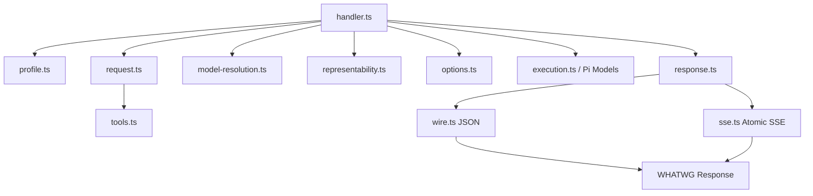

配套规范是 [Anthropic Messages Protocol](./Protocols/Anthropic%20Message%20Protocol.md)
与 [Anthropic ↔ Pi Conversion Method](./Protocols/Anthropic-Pi%20AI%20IR%20Conversion%20Method.md)。
配套测试按 source profile、request conversion、tools、options、response、SSE、HTTP
integration 分开，避免只通过一个 end-to-end happy path 掩盖某个阶段的 semantic
loss。

---

# 6. Pi Runtime、配置、Composition 与 CLI

## 6.0 小白导读：Pi 是统一插座，Composition 是开机装配员

LuckyToken 两边会不断变化：左边将来可能有 Anthropic、OpenAI Responses 等不同
Client Protocol，右边也可能增加更多 Provider。Pi 就像中间统一规格的插座。左边只需
把请求变成 Pi 插头，右边只需做成 Pi 插座，双方不必互相认识。

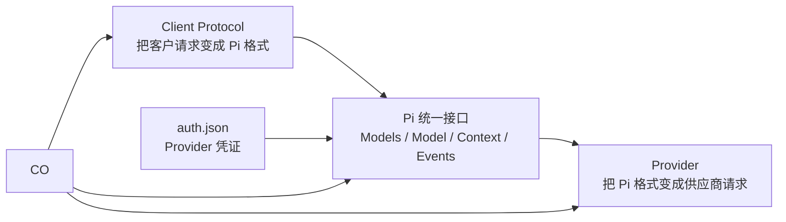

Composition 可以理解为“开门前装配员”：它读取文件、造好对象、把接口接起来，然后
退出日常请求流程。CLI 则是前台入口，负责启动服务、登录 Provider 或管理 Client
Token，但它自己不做协议翻译。

Pi 是 LuckyToken 的共享 runtime/IR contract，但 Pi Agent 不是 LuckyToken 的应用
架构。生产代码依赖 npm package `@earendil-works/pi-ai@0.84.1`；仓库中的
`pi-agent/packages/ai` 用于 source review/reference，不被 LuckyToken-specific 代码
修改。LuckyToken-owned 模块只补上文件加载、credential persistence、Provider
construction 和 CLI shell。

## 6.1 Pi public runtime contract

> **小白理解：** 这些 interface 是统一插座的尺寸图。`Models` 像总服务台，知道目前
> 安装了哪些 Provider 和模型；每个 `Provider` 像一个接入统一插座的供应商。Client
> Protocol 只把任务递给总服务台，不会越过 Pi 直接联系某个供应商。

LuckyToken 直接使用以下 Pi public interfaces：

```ts
interface Provider {
  id: string;
  name: string;
  auth: ProviderAuth;
  getModels(): readonly Model[];
  streamSimple(model, context, options?): AssistantMessageEventStream;
}

interface Models {
  getProviders(): readonly Provider[];
  getModels(provider?): readonly Model[];
  checkAuth(providerId): Promise<AuthCheck | undefined>;
  login(providerId, type, interaction): Promise<Credential>;
  logout(providerId): Promise<void>;
  streamSimple(model, context, options?): AssistantMessageEventStream;
}

interface MutableModels extends Models {
  setProvider(provider: Provider): void;
}
```

Pi `Models` 拥有 Provider collection、Provider auth resolution、credential application
和 request delegation；concrete Provider 拥有自己的 model list、auth methods 与
stream behavior。LuckyToken 不在两者之间加 Manager/Registry。

`Models.streamSimple()` 的输入/输出也是左右解耦的关键：

```text
Input
├── Model<Api>
├── Context
└── ModelsSimpleStreamOptions

Output
└── AssistantMessageEventStream
```

Client Protocol 只生产这些 Pi contracts；Provider 只消费这些 Pi contracts。

## 6.2 Provider model data — 内置模型目录，单一权威来源

> **小白理解：** 供应商的商品目录（模型 id、能力、容量）直接写在 LuckyToken 的
> Provider Package 里，用户不需要任何 `models.json`。安装并配置 package 后，
> `login` 填 API key 就能用。

CommandCode Private Provider Package 内置 **33 个模型**，全部硬编码在
`packages/provider-commandcode-private/src/models.ts`（`COMMANDCODE_MODEL_SOURCES`），这是
**唯一的模型权威来源**——没有运行时端点拉取，更新模型只需改这个文件。

模型数据来自 `doc/# CommandCode 1.9.0 模型信息表.md`（官方 command-code@1.9.0
bundle 静态分析）：

- `id`：官方权威 id（如 `deepseek/deepseek-v4-flash`、`Qwen/Qwen3.8-Max`）；
- `contextWindow` / `input`（text/image）：官方模态；
- `cost`：官方定价表（每百万 token USD）；
- `reasoningEfforts`：官方推理档位（如 DeepSeek 仅 `high/max`、Qwen3.8-Max 仅
  `low/medium/xhigh`）；官方未标注档位的模型保持全档位宽松。

`thinkingLevelMap` 由 `reasoningEfforts` 生成，语义是：客户端请求档位在模型支持
范围内 → 原样使用；不在范围内 → **fallback 到模型支持的最高档**（不报错、不发
无效参数）；模型明确标注 `null` 的档位 → 报错。

默认模型仍是 `deepseek/deepseek-v4-flash`（`COMMANDCODE_DEFAULT_MODEL_ID`）。

### 6.2.1 用户自定义 Provider — `models.json`（新增）

用户可通过 `pi.modelsJson` 配置（默认 `<pi.directory>/models.json`）注册自定义
Provider，复用 Pi 内置 api adapter：

```json
{
  "providers": {
    "my-anthropic": {
      "baseUrl": "https://gateway.example.com",
      "api": "anthropic-messages",
      "apiKey": "sk-...",
      "models": [
        { "id": "claude-sonnet", "contextWindow": 200000, "maxTokens": 64000 }
      ]
    }
  }
}
```

`src/providers/models-json.ts` 是 LuckyToken 自有解析器（最小 schema 子集，不
import coding-agent 参考源）；`catalog.ts` 用 Pi 公共接口 `createProvider` +
`getApiProvider(api)` 注册。apiKey 优先读 Pi `CredentialStore`（`login` 存储），
fallback 到配置字段。注册后走标准 Pi IR 路径：请求由对应 api adapter 按
`model.baseUrl` 直发，响应经 Pi 解析后渲染回 Anthropic。

## 6.3 Pi credential persistence — `src/pi/file-credential-store.ts`

> **小白理解：** `auth.json` 是“供应商保险柜”，保存 LuckyToken 登录外部 Provider
> 所需的 API key 或 OAuth 凭证。它不是 Agent 访问本地服务使用的门卡文件。加锁是
> 因为 Provider 凭证可能在运行时被登录、退出或自动刷新，多个动作不能同时改坏文件。

```ts
createFileCredentialStore(authPath): CredentialStore
```

实现的是上游 Pi 接口，而不是 LuckyToken 自定义 credential API：

```ts
interface CredentialStore {
  read(providerId): Promise<Credential | undefined>;
  list(): Promise<readonly CredentialInfo[]>;
  modify(providerId, fn): Promise<Credential | undefined>;
  delete(providerId): Promise<void>;
}
```

| 项目 | 内容 |
| --- | --- |
| 功能 | 按 Provider ID 保存一个 `api_key` 或 `oauth` credential；为 Pi login/refresh/logout 提供 serialized read-modify-write |
| 配套文件 | `.luckytoken/pi/auth.json` |
| 文件 owner | Pi `CredentialStore` implementation；Pi `Models` 是 semantic caller |
| 持有状态 | resolved auth path；操作期间的 file lock/parsed credential clone |
| 谁使用它 | `createModels({ credentials })` 间接通过 Pi `Models` 使用 |
| 它使用谁 | Node file API、`proper-lockfile`、Pi credential types |

每次操作可接收 `AbortSignal`，创建目录/文件时请求 0700/0600 权限，并用跨进程 file
lock 序列化 OAuth refresh、login write 与 logout delete。`list()` 只输出 Provider ID
和 credential type，不输出 secret。

这里使用 lock 是 Pi credential contract 的需要：运行时并发请求可能同时触发 OAuth
refresh。它与非并发管理的 Client token file 是两个不同 capability，不能因为都叫
“auth JSON”就共享实现。

## 6.4 Main deployment config — `src/cli-config.ts`

> **小白理解：** `.luckytoken/config.json` 是部署地址簿：服务监听哪里、每种客户协议去
> 哪个门卡文件、Pi 文件夹在哪里、请求限额多大。它只负责“东西放哪里、服务怎么开”，
> 不存模型业务语义或密钥。相对路径都以这份文件的位置为起点，所以从别的目录启动
> 也不会悄悄读错文件。

```ts
loadLuckyTokenCliConfig(path): Promise<LuckyTokenCliConfig>
```

严格文件 `.luckytoken/config.json` 的当前结构：

```json
{
  "server": { "host": "127.0.0.1", "port": 3000 },
  "clientProtocols": {
    "anthropic-messages": {
      "authFile": "client-auth/anthropic-messages.json"
    },
    "openai-responses": {
      "authFile": "client-auth/openai-responses.json",
      "stateFile": "state/openai-responses.json",
      "conversion": {
        "response": { "storeFalse": "honor" }
      }
    }
  },
  "providerPackages": {
    "@luckytoken/provider-commandcode-private": {
      "conversion": {},
      "request": {},
      "response": {}
    }
  },
  "pi": { "directory": "pi" },
  "limits": {
    "maxRequestBytes": 1048576,
    "requestTimeoutMs": 120000
  }
}
```

| 项目 | 内容 |
| --- | --- |
| 功能 | 验证 deployment location/binding/limits；把所有 relative path 按 config 所在目录解析；返回 frozen snapshot |
| 输入 | 必须显式提供的 config path |
| 输出 | host/port、protocol-specific config、package root→opaque config、Pi directory/modelsJson、limits |
| 谁使用它 | top-level CLI；composition 接收已验证 snapshot |
| 它使用谁 | Node path/file/stat |

未知字段、错误类型、非法 port/limit、空 protocol map、重复 lexical/physical auth
file 都失败。Protocol map 使用 null-prototype object，并由 consumer 做 own-property
lookup，避免 `__proto__`/inherited-name 污染。

Config loader 可以解析未来 protocol ID，但当前 concrete composition 会拒绝
“configured but not installed”的 protocol。Provider Package specifier 只允许 npm 根包名
或 scoped 根包名；相对/绝对路径、URL、Node builtin 与 package subpath 都失败。
旧 `providerAdapters.commandcode-private` 配置不保留兼容分支，直接报错。

## 6.5 Pi/Provider composition — `src/composition.ts`

> **小白理解：** Composition 是唯一看得见整张装配图的工位。它读取地址簿和目录，
> 分别造出 Auth、Pi、Provider、协议窗口与 Runtime，再把窄接口接好。装配完成后，
> 完整配置对象不会跟着每个请求到处旅行。

提供两个层次的构造接口：

```ts
createConfiguredPiModels(options)
  → { models: Pi.Models, externalProviderIds: readonly string[] }

createConfiguredLuckyTokenComposition(options)
  → { runtime: LuckyTokenRuntime, certification: ServingCertificationManifest }
```

### `createConfiguredPiModels()`

> **小白理解：** 这一层只组装 Pi 的“模型侧”：读取模型目录、准备 Provider 凭证柜、
> 这一层只组装 Pi 的“模型侧”：准备 Provider 凭证柜，按 Pi builtins、
> `models.json`、外部 Provider Packages 的固定顺序登记。结果对外只是普通的 Pi
> `Models`，上层看不见 CommandCode 的私有实现。

| 输入 | 输出/行为 |
| --- | --- |
| `piDirectory` / `modelsJson` | 定位 `auth.json` 与可选用户自定义 Pi Provider 目录 |
| optional `CredentialStore` | 测试/嵌入方可替换 file store |
| `providerPackages` | package 根名 → package-private raw configuration |
| required bound `fetch` | 通过最小 host capability 交给 external Provider；不使用 ambient fallback |
| ID/clock | 通过同一最小 host capability 交给 external Provider |

**CommandCode 是通过 Pi Provider 契约加载的私有 workspace package。** 模型数据（默认
`deepseek/deepseek-v4-flash`）、固定上游地址（`https://api.commandcode.ai`）、
auth（API key login）都封装在 `@luckytoken/provider-commandcode-private` 内。
Core 不 import 或 special-case 该实现；`package-loader.ts` 只认 Provider Package
Contract 和固定 `providerPackage` 导出。配置 package 根名后不需要 `models.json`，
`login` 填 API key 即可 serve。

Loader 先导入、验证并暂存同批全部 package，随后对 Pi builtins、`models.json` 和同批
Provider 做 ID 冲突检查，全部成功后才调用 `models.setProvider()`，因此失败不会留下
半注册状态。package 缺失、固定导出缺失、契约版本不匹配、同步/异步 factory 失败、
非法 Pi Provider 或 ID 冲突都使启动失败。缺少 API key 不阻止装配或 `serve`；真实
调用时由 Pi credential/auth 路径报告。`serve`、`login`、`logout` 走同一加载路径，
`client-token` 只解析配置而不动态 import package。

### `createConfiguredLuckyTokenComposition()`

> **小白理解：** 这一层再组装完整服务：为已安装的 Client Protocol 建立各自独立的
> Auth 和 handler，把 handler 交给 Runtime。它知道“哪些零件要接在一起”，却不
> 参与任何一边的翻译规则。

它是当前 concrete serving composition，唯一同时知道 installed Client Protocol 和
installed Provider 的位置。职责严格限定为：

```text
protocol id → authFile → immutable authority → Auth → handler
catalog → Pi builtins → models.json → package loader → external Providers → Pi Models
handler list → Runtime
provider-neutral bound facts → Core serving certification
```

它不做 Anthropic↔Pi 或 Pi↔CommandCode conversion。完整 `LuckyTokenCliConfig` 在
这里被拆成窄 constructor facts，之后不进入 Runtime request path。

`createConfiguredLuckyTokenComposition()` 不创建或传递 HTTP observer。它把 bound
fetch 交给 concrete Provider，并另以 handler-private `passthroughFetch` 绑定 native
wire forwarding。Conversion invocation 不接收 composition 注入的 custom fetch；
Provider failure 只通过 trusted neutral Pi diagnostics 跨越 execution boundary。
`createConfiguredPiModels()` 不把 infrastructure 对象作为公共返回值泄漏。

当前 production composition 的运行时 certification 只认证 provider-neutral Core。
CommandCode Provider Package 与整套 distribution 的 certification 位于测试/分发边界；
它们验证 package 契约、动态加载、协议冻结测试与真实线上证据，不能拿 Core 认证替代。

## 6.6 Serving certification — Core 与 Distribution 分离

> **小白理解：** Certification 像营业前的整套验收清单。它核对实际装上的模型、地址、
> 认证方式、取消策略和转换版本是否仍是经过测试的组合。验收失败就不启动，避免
> “零件都能单独工作，但接在一起已经不是测试过的系统”。

`src/core-serving-certification.ts` 只记录 Client Protocol、实际 Provider IDs、注册顺序
和 runtime limits，不绑定某个 private Provider。CommandCode-specific 的完整 conformance
manifest 位于 `test/support/commandcode-serving-certification.ts`，作为 Provider /
Distribution certification 验证 package、动态加载与线上证据，不进入 Core runtime。

```ts
certifyServingComposition(facts): ServingCertificationManifest
```

Core certification 不是 request processor。它在 startup 检查 provider-neutral 的
Client Protocol、实际 Provider IDs、注册顺序与 limits。Provider/Distribution
certification 另行绑定 CommandCode model、endpoint、Auth、转换 revision、package
identity 与 conformance hash。

| 输入 | 当前 bound facts 的只读描述，不是 live service objects |
| --- | --- |
| 输出 | deep-frozen `CERTIFIED` 或 `FAILED` manifest |
| 配套文件 | `test/fixtures/certification/serving-conformance-v2.json` 与 certification tests |
| 谁使用它 | composition root；失败时阻止启动 |
| 它使用谁 | provider-neutral composition facts；CommandCode-specific facts只存在于测试/分发认证 |

Certification 可以看见左右两侧是为了证明一个具体 serving route，但不能进行协议
转换。Injected test Auth 不会被错误标记为 file-snapshot isolation；只有真实
handler-bound file authority 才带对应 coverage fact。

## 6.7 Process CLI — `src/cli.ts`

> **小白理解：** CLI 是用户面对的前台。`serve` 开门营业，`login/logout` 管理
> LuckyToken 去 Provider 的身份，`client-token` 管理 Agent 进入某个 Client Protocol
> 的门卡。前台只把命令转交给对应部门，不自己读写协议内容。

Top-level CLI 是进程 composition root/shell，不是业务 Manager：

| 命令 | 使用模块 | 产生的外部效果 |
| --- | --- | --- |
| `serve --config ...` | config loader → full composition → HTTP server | listener；SIGINT/SIGTERM graceful shutdown |
| `login [provider] --config ...` | configured Pi Models → `Models.login()` | Provider-owned login flow；credential 写入 Pi `auth.json` |
| `logout [provider] --config ...` | configured Pi Models → `Models.logout()` | 删除对应 Provider credential |
| `client-token ...` | narrow auth-file resolver → client-token CLI | 修改一个 Client Protocol token file；要求重启 |

Login UI 枚举 `models.getProviders()` 和每个 `Provider.auth`：如果 Provider 提供 OAuth
则可显示 subscription/account；如果提供 `apiKey.login` 则显示 API-key 选项。CLI
只实现通用 prompt/notify shell，不硬编码 CommandCode key prompt。当前
CommandCode Provider 只注册 API-key login，因此实际只出现该选项。

Serve 时 CLI 构造一个 process shutdown controller；signal 同时进入 Runtime
lifecycle 和 HTTP server close，确保停止接受请求、abort 上游工作并关闭 socket。

## 6.8 Pi 文件与 ownership 关系

> **小白理解：** Pi 文件柜里现在只有一只抽屉：`auth.json`（供应商凭证）。模型和
> Provider 的静态资料内置在 LuckyToken 代码里，不需要配置文件。

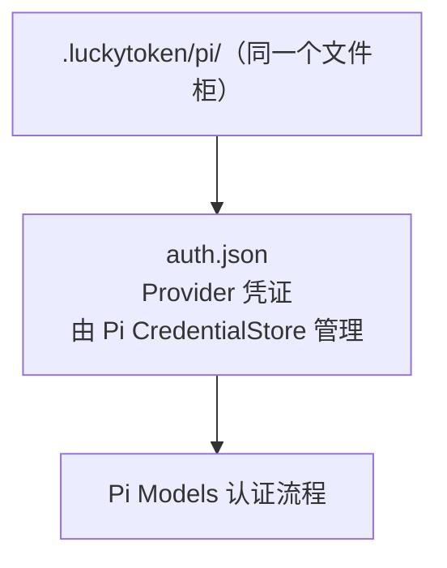

```text
.luckytoken/pi/
└── auth.json
    owner: Pi CredentialStore contract implementation
    semantics: mutable Provider credentials keyed by Provider ID
    readers/writers: Pi Models login/logout/getAuth/refresh
```

Provider model definition 不能包含本地 Client Protocol token；Client Auth 模块
也不能读取 Pi directory。

---

# 7. CommandCode Private Provider 模块

## 7.0 小白导读：这是只懂 CommandCode 的“供应商联络部”

Pi 给出的已经是统一任务单，但 CommandCode 有自己的网址、认证、请求表格和逐行返回
格式。本章模块像专门联系这家供应商的采购部门：把 Pi 任务单改写为 CommandCode
订单，可靠地发送和收货，确认所有包裹齐全后，再交回一份标准 Pi 结果。

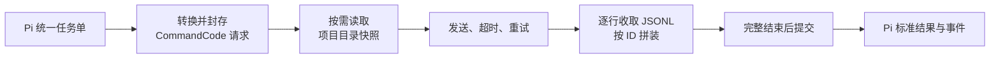

这个部门不知道最初的客户讲 Anthropic 还是 OpenAI Responses；它只接收 Pi。
同样，Client Protocol 也不知道这里使用 CommandCode。这就是左右两侧解耦的实际落点。

目录 `packages/provider-commandcode-private/src/` 是完整 Pi ↔ CommandCode capability。它从
Pi Provider invocation 得到唯一语义输入，生成稳定 CommandCode request；执行真实
HTTP attempts；在 physical EOF 后原子提交 JSONL result；再把结果转换并 replay 为
Pi `AssistantMessageEventStream`。它完全不知道请求最初来自 Anthropic 还是未来
OpenAI Responses。

## 7.1 Provider factory 与 Pi 接口 — `provider.ts`

> **小白理解：** Provider factory 像为特定供应商创建一名专员。专员向 Pi 展示统一的
> 模型、登录和执行接口，内部才知道 CommandCode 的细节。API key 由 Pi 的凭证流程
> 交给它使用，不会写进模型目录，也不会暴露给 Client Protocol。

```ts
interface CommandCodePrivateProviderOptions {
  apiKey?: string;
  fetch?: FetchFunction;
  model: Model<"commandcode-private">;
  now: () => number;
  projectSnapshot: ProjectSnapshot;
  compatibility?: CommandCodeCompatibilityPolicy;
  createSessionId?: () => string;
  traceContext?: CommandCodeTraceContextCapability;
  sleep?: (delayMs, signal) => Promise<void>;
}

createCommandCodePrivateProvider(options)
  → Pi.Provider<"commandcode-private">
```

输出 Provider identity 与 model API identity 固定为：

```text
Provider.id   = commandcode-private
Provider.name = CommandCode Private
Model.api     = commandcode-private
```

CommandCode 是 Pi 内置风格 Provider 实现（对齐 `deepseekProvider()` 形态），但由
独立 Provider Package 交付：
`createCommandCodePrivateProvider()` 自带固定上游地址
`https://api.commandcode.ai` 和内置默认模型，`auth.apiKey.login` 让用户只填
API key 即可使用。用户无需 `models.json`，只需在 `providerPackages` 声明已安装包；测试通过
`LUCKYTOKEN_COMMANDCODE_BASE_URL` 环境变量指向 fixture 上游。

| 项目 | 内容 |
| --- | --- |
| 功能 | 实现 Pi Provider auth/model/stream contract；编排 request preparation、attempt、semantic commit、Pi replay |
| 输入 | Pi `Model + Context + SimpleStreamOptions`；构造期 bound dependencies |
| 输出 | Pi `AssistantMessageEventStream` |
| 持有状态 | frozen model、compatibility、project/trace capabilities、stream functions；无 conversation store |
| 配套文件 | 自己不直接读取文件；model/credential/project facts 都从相邻 capability 注入 |
| 谁使用它 | Pi `MutableModels.setProvider()` 后由 Pi `Models` dispatch |
| 它使用谁 | project、attempts、assembler、semantic、lossless JSON 模块；Pi provider helpers |

Provider auth 通过 Pi `Provider.auth.apiKey` 暴露：

- `login(interaction)` 只负责通用 secret prompt 并返回 Pi `ApiKeyCredential`；
- Pi `Models.login()` 负责调用并持久化到 `CredentialStore`；
- request-time `resolve()` 优先使用 Pi stored credential；只有未存储时才使用可选
  deployment fallback `options.apiKey`；
- Provider credential 只存于 Pi CredentialStore（`auth.json`），从不进入代码或
  配置文件。

## 7.2 Pi Context → CommandCode messages/tools — `provider.ts`

> **小白理解：** 这是“下单翻译”。它把 Pi 的对话、图片、思考、工具调用和工具结果
> 逐项换成 CommandCode 表格；无法准确表达的内容会拒绝，而不是删除。工具调用 ID
> 就像订单行号，必须从请求到结果始终一致。

主要纯转换接口：

```ts
convertCommandCodeMessages(model, context)
  → CommandCode wire messages[]

convertCommandCodeTools(context.tools)
  → CommandCode wire tools[]

buildCommandCodeBody(model, context, options, config, sessionId, compatibility, requestPolicy)
  → { body, supportedReasoningEfforts, notices }
```

### Message conversion

| Pi input | CommandCode output |
| --- | --- |
| user text | `{ role:"user", content:[{type:"text", text}] }` |
| user image | data URL image block；要求 model image capability |
| assistant text | assistant text block |
| assistant thinking | assistant reasoning block |
| assistant toolCall | `tool-call`，精确保留 ID/name/lossless JSON input |
| ToolResultMessage | adjacent `role:"tool"` 的 `tool-result`，error 映射为 `error-text` |

Historical `AssistantMessage.stopReason` 对 CommandCode request 是 targetless fact，所有
当前或未来值都被忽略，content 仍按顺序转换并独立校验。无 target slot 的 text/thinking/
tool signatures 被丢弃；redacted thinking 只丢弃该 block，不影响同一消息的其他内容。
ToolResult image 被丢弃、文字保留，image-only 使用空字符串保持 correlation。
真实 ToolResult 保留 Pi `toolCallId`、非空 `toolName` 与 `isError`；synthetic result 使用
pending call ID/name 和 Provider request policy 的 `text|error-text`。每次 missing-result
修复还会产生 request-local、非模型可见的 Provider notice。

如果 Pi history 含 tool call 但结果丢失，Provider 按 CommandCode wire 要求生成一个
与原 call ID 配对的明确 missing-result block，而不是删除 tool call 或猜测结果。

### Tool definition conversion

Pi tool name/description/parameters 变成 CommandCode tool definition。所有 schema
必须是 lossless JSON object。CommandCode 没有 constrained-sampling wire field，因此
absent/false/prefer/require/grammar 都降为同一个普通 target tool，不向 prompt、description
或 schema 注入指令。`strict=require` 是冻结的可用性例外：不拒绝请求，但产生
request-local、非模型可见的 Provider degradation notice；这不代表上游执行了 strict。

### Body controls

Request body 固定包含：

```text
config
memory = null
taste = null
skills = null
permissionMode
threadId
params
  ├── model
  ├── messages
  ├── tools
  ├── max_tokens
  ├── stream = true
  ├── system?
  ├── temperature?
  └── reasoning_effort?
```

Pi reasoning level 只在 selected model 支持时映射为 CommandCode
`low|medium|high|xhigh|max`。Pi deferred execution 当前明确不支持。

## 7.3 Project capability — `project.ts`

> **小白理解：** Project capability 是一个受控的“项目资料员”。只有项目门卡认证后
> 产生的目录才会到达这里，资料员才读取该目录的顶层结构和 Git 概况。全局门卡不会
> 凭空猜测当前目录；指定目录读取失败也不能偷偷退化成全局请求。

```ts
interface ProjectSnapshot {
  snapshot({ projectDir, signal }): Promise<ServerConfig>;
}

classifyProjectDir(options.metadata): string | undefined
createNodeProjectSnapshot(): ProjectSnapshot
```

| 项目 | 内容 |
| --- | --- |
| 功能 | 把已经由 Auth 建立并通过 Pi metadata 传来的 projectDir 转成 CommandCode `ServerConfig` |
| 输入 | 唯一 project fact `projectDir` + request signal |
| 输出 | workingDir/date/platform/top-level structure/git facts |
| 持有状态 | 无跨请求 cache；每次 invocation 建立一次 snapshot |
| 配套文件 | 只读 project directory 与其 Git metadata；不写项目文件 |
| 谁使用它 | `prepareCommandCodeRequest()` |
| 它使用谁 | injected directory/Git/date/platform capabilities；Node factory 使用 `readdir` 和 `git` subprocess |

Global client token 不产生 `projectDir`，Provider 使用严格 empty `ServerConfig` 且不发
`x-project-slug`。Project token 产生唯一目录；Provider snapshot failure/目录不可读
不能把请求降级为 global。`process.cwd()` 绝不作为隐式 project identity。

Project snapshot 只列出非隐藏且未排除的 top-level entries，并采集 branch/status/最近
commit。`x-project-slug = slugify(projectDir) || "root"` 是 Provider-owned wire
derivation；Auth/Pi 不知道这个 header。

## 7.4 Request preparation/authority closure — `provider.ts`

> **小白理解：** 这里像正式封箱：先确定模型、会话、项目资料和网络地址，再生成完整
> 订单并重新验货，最后把它冻结。即使扩展回调参与修改载荷，也不能偷换已经确认的
> 模型或项目。一次逻辑任务只封箱一次，重试时仍发送同一份权威订单。

```ts
prepareCommandCodeRequest(model, context, options, dependencies)
  → PreparedCommandCodeRequest
```

一次 logical invocation 只准备一次：

```text
snapshot invoked model
→ resolve sessionId / logical trace / projectDir
→ resolve project snapshot once
→ build authoritative headers/body
→ optional Pi onPayload callback
→ JSON serialize
→ parse and validate against captured authority
→ freeze endpoint/headers/bodyText/signal/fetch
```

`validateCommandCodeRequest()` 在 callback 和 serialization 之后重新检查 model ID、
session、project config、permission、image/reasoning capabilities、message/tool lifecycle
和 closed-world fields。因此 callback 可以参与 Pi-defined payload transform，但不能
偷偷改写 Provider authority。

Transport 选择 precedence 是 request `options.fetch` → Provider-bound fetch → global
fetch。当前 certified composition 总是显式绑定 fetch，并禁止依赖 global fallback。
在 certified composition 中，CommandCode Provider 直接持有原始 bound fetch。每个
physical attempt 在 Provider 内有界读取自己的失败 response，并只把 neutral fact 与
attempt summary 提升到 Pi diagnostics。Client conversion handler 不包装任何 Provider
transport，也不通过 `options.fetch` 建立观察旁路。

## 7.5 HTTP attempt/retry/cancellation — `attempts.ts`

> **小白理解：** 一张订单可能因为断网、限流或服务器故障需要重寄。订单内容和逻辑
> 编号保持不变，但每次寄送都有自己的超时和追踪编号。客户取消时，正在发送、等待
> 重试或收取回包的动作都会停止，不会留下后台任务继续消耗资源。

```ts
resolveCommandCodeExecutionControls(options)
  → { maxRetries, timeoutMs, maxRetryDelayMs, onResponse }

executeCommandCodeAttempts(prepared, model, controls, dependencies)
  → Promise<CommandCodeResult + immutable attempt summaries>
```

| Logical invocation state（跨 retry 稳定） | Physical attempt state（每次新建） |
| --- | --- |
| endpoint、headers baseline、bodyText、caller signal、logical trace ID | timeout controller、span ID/traceparent、Request/Response、reader/decoder、assembler |

Retry 只发生于 network/transport failure、429、5xx、terminal-less EOF 或明确
retryable stream error，并受 `maxRetries` 限制。Delay precedence 是
`retry-after-ms`、`retry-after` seconds/date、再 exponential fallback；server delay
不能超过 configured max。

Caller cancellation 在 retry sleep、fetch、onResponse callback、body read 和 commit
前传播；已经形成的 upstream stream terminal 不会被稍后翻转的 caller signal 重新标成
Pi aborted。Attempt timeout 只结束当前 attempt，并按触发位置保留 `connect`、
`response_headers` 或 `response_body` phase。响应 body cleanup 是 best-effort，不能
掩盖已经形成的 primary failure。

HTTP non-2xx、HTTP-200 stream error、connect/body/EOF、timeout、protocol、configuration、
callback、retry-delay 与 caller cancellation 都先形成 neutral failure。Retry 只读取
`failure.retryable === true`。每个 started attempt 都生成可信 diagnostic；execution 按序
提交到 handler-owned invocation sink，最终失败由 handler 恰好写一个 journal。

## 7.6 CommandCode response transport — `attempts.ts`

> **小白理解：** CommandCode 把回答写成一行一行的 JSON，但网络快递箱可以在任意
> 字节处拆分，一行也可能横跨多个箱子。这里先把字节重新拼成完整行，再交给内容
> 拼装器；看到“完成”行后仍要等运输真正结束，才能确认没有尾部错误。

上游 endpoint 是 resolved model base URL authority 上的 absolute path `/alpha/generate`；
任何 base path/query/fragment 都被替换或丢弃，而不是把 path 追加到 prefix。虽然 response media
type 可能写 SSE，实际 framing 是 bare newline-delimited JSON：没有 `event:`、`data:`、
blank-line delimiter 或 `[DONE]`。

`consumeCommandCodeResponse()` 使用 streaming `TextDecoder` 跨 HTTP chunks 组装完整
line，再逐行送入新的 `CommandCodeContentAssembler`。一个 chunk 不等于一个 event，
一个 UTF-8 code point 也可能跨 chunk。

Physical EOF 是成功条件的一部分：看到 `finish` 后仍继续读取；只有 EOF 到来且所有
content lifecycle closed 才可能返回成功 result。

## 7.7 Atomic ordered JSONL assembler — `assembler.ts`

> **小白理解：** Assembler 像按编号拼一套拼图。正文、思考和工具调用都可能分多次
> 到达，它按开始顺序预留位置，并按各自 ID 累积；工具参数预览绝不算完成。只有所有
> 拼图闭合、收到合法结束信息且运输 EOF 到达，整份结果才一次性成立。任何失败都会
> 清空本次拼图，不能污染下一次请求。

```ts
class CommandCodeContentAssembler {
  consumeRawLine(line): void;
  finalizeAfterTransportEnd(): CommandCodeResult;
}
```

内部状态高内聚在一个 request-local reducer：

```text
slots[]              start-event arrival order
textById             text lifecycle
reasoningById        reasoning lifecycle
toolById             partial tool-input lifecycle
finish/rawUsage      terminal candidate
```

关键不变量：

- **只有指定 event type 进入 content。** 进入 content 的事件只有三类生命周期：
  `text-start/delta/end`、`reasoning-start/delta/end`、
  `tool-input-start/delta/end + tool-call`；且只有 `*-start` reserve ordered slot；
  delta/end 不能重排；
- 其他事件按协议分类：`start`、`start-step`、`provider-metadata`、response-side
  `tool-result` validate-then-drop；`finish-step` 额外 stage 最后一个合法 response
  id/modelId pair，但其 usage 不覆盖 final finish；`finish` 决定终止 reason 与 final
  usage；`abort`/`error` 立即产生 neutral failure；
- `providerExecuted`/`dynamic` 等 server-owned 元数据**不读取、不校验、不保留**
  （协议文档 §2.8）：`tool-input-start`/`tool-call` 只消费 `id`/`toolName`/
  `toolCallId`/`input` 等转换所需字段，这些额外字段的生命周期在 event 消费时即
  结束，不进入 committed response；
- text/reasoning 必须 start → delta* → end，结束时不能是空内容；
- tool 必须 `tool-input-start → delta* → input-end → authoritative tool-call`；
- partial tool preview 不是 completed tool input；只有 final `tool-call` 的 lossless JSON
  object materialize；primitive/null/array input fail closed；
- known malformed lifecycle/field/non-JSON line 是 non-retryable protocol error；
- unknown future event 不猜测语义，使用 Provider `error|ignore` policy（default error）；
  ignore 只留下 bounded response notice，仍不能代替 finish；
- `abort`、stream error 无成功 result；exact raw `pause_turn` 在 closed slots/EOF 后使用
  `stop|error` policy（default stop），stop 保留 committed facts并添加 degrade notice；
- final `finish` 覆盖 earlier finish/usage，但不能代替 physical EOF；
- EOF 无 finish 是 retryable transport error；EOF 时还有 open slot 是 protocol error；
- 任意 failure 都清空 slots/maps/terminal/identity/notices，避免 partial state 泄漏；
- successful `CommandCodeResult` 的 content/tool input/finish/raw usage/identity/notices
  均 deep-frozen，交错或并发 response 不共享状态。

Assembler 输出仍是 Provider-local `CommandCodeResult`，生命周期只到 semantic
conversion；它不是 Pi contract，也不离开 Provider 目录。

## 7.8 CommandCode result → Pi semantic commit/replay — `semantic.ts`

> **小白理解：** 这是“收货验收并换回统一包装”。它把已经完整提交的 CommandCode
> 内容、停止原因和用量转换成 Pi 结果，然后按 Pi 的标准事件顺序重放。上层看到的
> 永远是 Pi 生命周期，不会看见 CommandCode 私有 JSONL 或半成品。

```ts
captureCommandCodeResponseAuthority(model, now)
  → CommandCodeResponseAuthority

convertCommittedCommandCodeResult(result, authority)
  → Pi.AssistantMessage

replayCommandCodeAssistantMessage(stream, message, signal): void
```

Provider invocation 开始时就 snapshot response identity、timestamp 和 pricing model，
避免 callback/mutable model 在 response 阶段改变 authority。

Conversion 只在 assembler commit 后发生：

- CommandCode text → Pi `TextContent`；
- reasoning → Pi `ThinkingContent`；已经收到的可表示内容不会因为 model catalog 的
  `reasoning:false` 请求能力声明而被拒绝；
- client-owned tool use → Pi `ToolCall`，ID/name/lossless JSON arguments 保留；
- last finish-step identity → Pi `responseId` / `responseModel`；没有来源时省略；
- `providerExecuted`/`dynamic` 等 server-owned 元数据在 assembler 阶段已不保留，
  这里不再读取或检查；
- usage 消费 final finish 的 raw total 与已知 alias：`inputTokens` 与显式
  `noCache + cacheRead + cacheWrite` 分区互相校验，nested/top-level cache-read 与
  reasoning aliases 必须一致，source `totalTokens` 必须等于 Pi components；当前 wire
  没有 one-hour cache-write split，因此不猜测 `cacheWrite1h`；最后用 captured pricing
  model 算 cost；
- finish 的 `length` 优先；否则由实际转换后的 ToolCall content 决定 `toolUse` / `stop`。
  Wire category 与内容不一致时只产生 non-model-visible diagnostic，原始 reason 仍保留；
  pause-stop 走同一个 converter。

Converter 只接受 immutable committed result，并返回 deep-frozen Pi message。任何 content
或 usage 不一致都产生 neutral `kind:"conversion"` error terminal，不重放 partial success。

Replay 在完整 `AssistantMessage` 已知后生成 Pi start/content/done events。任何 error 或
abort 只发 Pi error terminal；如果 signal 在 replay 前 abort，已完成内容也被丢弃并
替换为空 aborted message。这样 Client Protocol 看到的是 Pi 标准 lifecycle，而不是
CommandCode JSONL。

## 7.9 Lossless JSON boundary — `json.ts`

> **小白理解：** JSON 看起来简单，但程序对象里可能藏着 JSON 无法准确保存的数字、
> 循环引用或特殊属性。这个模块是“复印前检查员”，只允许真正可以原样复印的数据，
> 防止序列化时内容悄悄变化，尤其保护工具参数和 schema。

`cloneLosslessJson()`/`cloneLosslessJsonObject()` 只接受真正可无损 JSON 表达的数据：
finite non-`-0` numbers、dense arrays、plain/null-prototype objects、无 symbol/accessor/
cycle/custom serialization。它被 tool schemas、tool arguments 和 Provider request
conversion 共用，防止 `JSON.stringify` 静默改变 semantic value。

## 7.10 Provider 内部关系

> **小白理解：** 下图是一张供应商部门内部流程图。Pi 只连接最外层 Provider 接口；
> 项目读取、重试、JSONL 拼装和语义转换都是 CommandCode 模块自己的内部岗位，不会
> 散落到 Runtime、Auth 或 Anthropic 模块中。

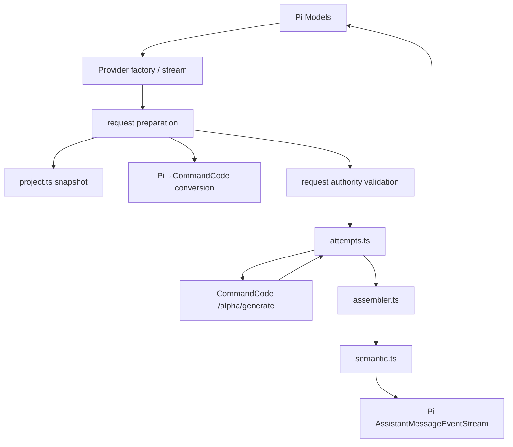

配套规范是 [CommandCode Private Protocol](./Protocols/commandcode%20private%20protocol.md)
与 [Pi ↔ CommandCode Provider Conversion Method](./Protocols/PI%20AI%20IR-Commandcode%20Private%20Conversion.md)。

---

# 8. 持久文件、生成物与公共 API

## 8.0 小白导读：不同资料放进不同抽屉

这一章回答两个实际问题：磁盘上每个文件是谁的、改动何时生效；其他程序又能通过
哪些正式入口使用 LuckyToken。项目没有把所有资料塞进一个万能 JSON，因为地址簿、
客户门卡、模型目录和供应商密钥的主人与变化速度都不同。

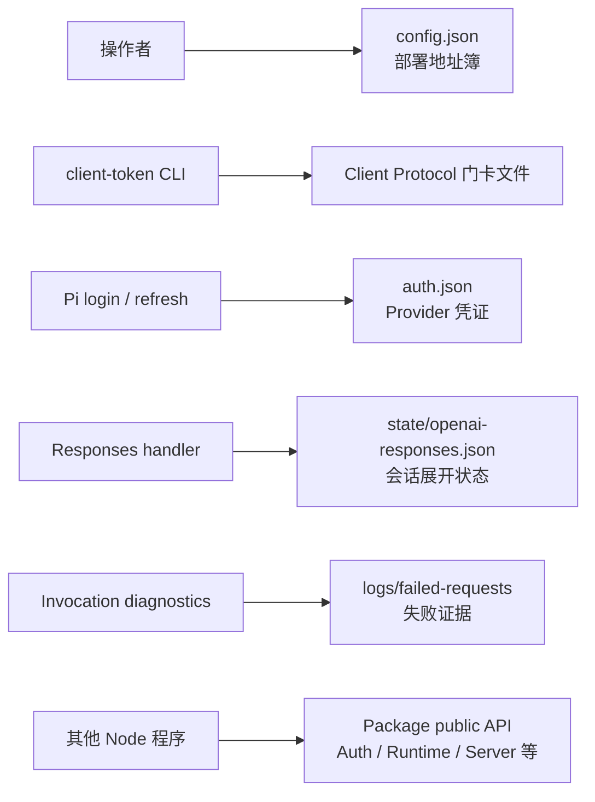

## 8.1 运行目录文件地图

> **小白理解：** 文件树就是一张文件柜标签图。“owner”表示哪个模块有权解释和修改
> 这份资料，“runtime form”表示启动后它变成什么。除了动态 Provider 凭证外，大多数
> 文件只在启动时读取一次，所以手工修改后需要重启才能生效。

```text
.luckytoken/
├── config.json
│   owner: deployment config loader
│   writer: operator
│   readers: CLI startup/client-token resolver
│   lifetime: one startup snapshot
│
├── client-auth/
│   owner: per-Client-Protocol Auth file capability
│   writer: client-token CLI
│   reader: startup authority loader
│   runtime form: one immutable authorize(token) closure per protocol
│   │
│   ├── anthropic-messages.json
│   └── openai-responses.json
│
├── state/
│   └── openai-responses.json
│       owner: OpenAI Responses session-state capability
│       writer/reader: serving-time atomic snapshot lifecycle
│       runtime form: bounded previous_response_id authority
│
├── logs/
│   └── failed-requests/*.json
│       owner: invocation diagnostics capability
│       writer: final request-failure journal
│       runtime form: bounded/redacted per-request evidence
│
└── pi/
    └── auth.json
        owner: Pi CredentialStore implementation
        writer/reader: Pi Models login/logout/getAuth/refresh
        runtime form: effective Provider auth applied by Pi Models
```

这些文件没有统一成一个“大配置文件”，因为它们的 semantic owner、mutation
frequency、secret level 和 lifetime 不同：

| 文件 | 静态/动态 | 是否 secret | 是否 serving 期间读取 | 变化生效 |
| --- | --- | --- | --- | --- |
| `config.json` | 静态 deployment | 否 | 否 | 重启 |
| protocol token file | 低频管理 | 是 | 否 | 重启后新 snapshot |
| Responses state snapshot | 动态协议状态 | 含会话内容 | 是 | 内存 commit；持久化异步/关闭时 flush |
| failure journal | 动态诊断证据 | safe/full policy 决定 | 只写 | 每个最终失败请求 |
| `auth.json` | 动态 Pi credential | 是 | 由 Pi auth operations 读取 | login/logout/refresh contract |

所有 `.luckytoken/`、任意 `auth.json`、`CommandcodeAPIKey.txt` 和
`.online-artifacts/` 都被 `.gitignore` 排除。

## 8.2 测试专用 secret/evidence 文件

> **小白理解：** 这些是质检室的材料，不是营业中的数据库。真实在线测试会临时读取
> API key 并保存经过检查的协议证据，但生产请求不会自动被集中记录。它们都被 Git
> 忽略，避免把密钥或大量在线样本提交进源码仓库。

| 文件 | Owner/用途 | 是否进入 production |
| --- | --- | --- |
| `CommandcodeAPIKey.txt` | online runner 只在内存中读取真实 Provider key | 否 |
| `.online-artifacts/commandcode-conformance-samples.json` | online conformance 的 Client/Pi/Provider wire 证据，secret 被拒绝/替换 | 否 |
| `test/fixtures/certification/*.json` | immutable source-validity/serving coverage record | 只作为 startup certification 绑定证据 |
| `test/fixtures/commandcode-golden-request.json` | Provider request regression authority | 否 |

Online artifact 不是 runtime log store。Production persistence 分成两个窄 owner：
Responses session state 只保存其 `previous_response_id` 展开所需的有界 wire items；
invocation diagnostics 只为最终失败写有界/脱敏 journal。二者都不是跨协议的通用
conversation store 或全量 request logging subsystem。

## 8.3 Package/public module seams

> **小白理解：** Public seam 可以理解成正式对外开放的插口。其他 Node 程序可以只
> 选择 Auth、Runtime、HTTP Server，或单独选择 Anthropic handler、CommandCode
> Provider 来自行装配；CLI 内部的总装配细节没有全部变成公共承诺。

根导出 `luckytoken`：

```text
createAuth + Auth types
createLuckyTokenRuntime + Runtime types
createFileCredentialStore
startLuckyTokenHttpServer + server types
```

Subpath `luckytoken/protocols/anthropic`：

```text
createAnthropicMessagesHandler
AnthropicMessagesHandlerOptions
defaultAnthropicModelValidityPolicy
AnthropicModelValidityPolicy
```

私有包 `@luckytoken/provider-commandcode-private` 的根入口只导出固定
`providerPackage`、现有直接 Pi Provider factory 与 options 类型、必要的
`ProjectSnapshot` 类型。LuckyToken 根包不再导出 CommandCode subpath。

私有包 `@luckytoken/provider-contract` 只暴露 `/package` 与 `/diagnostics`；前者定义
加载契约，后者保证 Core 与 Provider 共享同一个 trusted diagnostics 运行时实例。

`cli.ts`、`cli-config.ts`、`composition.ts` 和 client-token administrative store 当前是
application-internal seams，不在 package root exports。`package.json` 目前
`private:true`，所以这里的“public”表示 build/package boundary，而不是已经发布到 npm
的稳定兼容承诺。

程序化最小装配接口是：

```ts
const auth = createAuth(...);
const handler = createAnthropicMessagesHandler({ models, auth });
const runtime = createLuckyTokenRuntime({ clientProtocols: [handler] });
const server = await startLuckyTokenHttpServer({ runtime });
```

这个接口允许替换 Provider、Auth authority 或 HTTP host，而不需要使用 CLI concrete
composition。

---

# 9. 生产模块总目录

## 9.0 小白导读：把这一章当成公司通讯录

前几章按一次请求的旅程讲系统，本章则按文件列出每个岗位。遇到“这个文件到底做
什么、它找谁帮忙、谁会找它”时，就查对应表格。箭头方向不是网络方向，而是代码
中的调用关系。

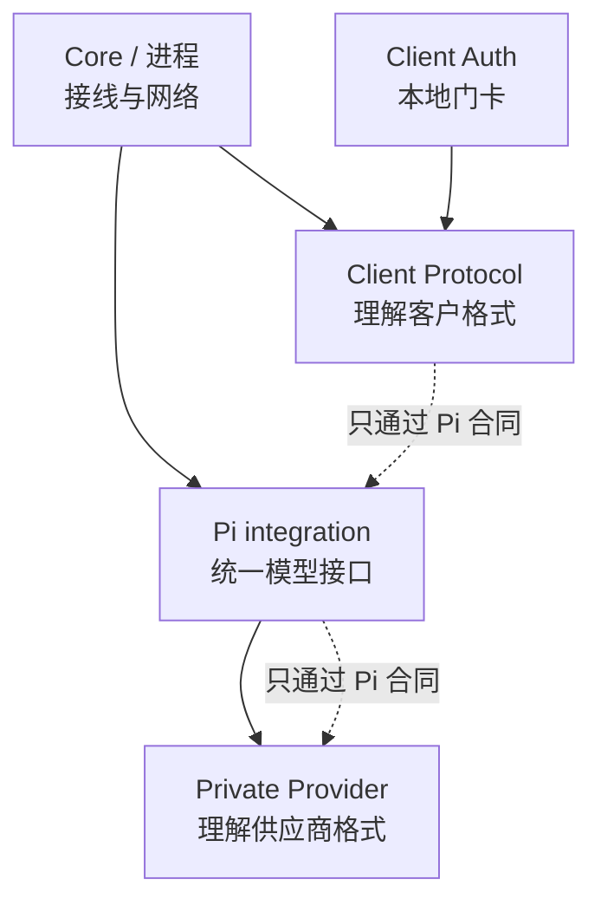

本章用于快速回答“某个文件左右上下连接谁”。“上游 caller”表示谁调用/构造它，
“下游 dependency”表示它直接使用谁；不是 Client/Provider wire 的上下游含义。

## 9.1 Core、进程与 Client Auth

> **小白理解：** 这组模块负责“服务怎么开、请求怎么进、门卡怎么查、对象怎么组装”。
> 它们不应该理解 Anthropic 内容块或 CommandCode JSONL；如果在这里看到具体协议的
> 字段转换，通常就是边界开始混乱的信号。

| 模块 | 主要接口/输出 | 上游 caller | 下游 dependency | 配套验证 |
| --- | --- | --- | --- | --- |
| `src/index.ts` | package root re-exports | programmatic consumer | Auth、Runtime、CredentialStore、Server | `test/unit/public-api.test.ts` |
| `src/server.ts` | `startLuckyTokenHttpServer()` → running server | CLI/programmatic/tests | Node HTTP/stream、`LuckyTokenRuntime` | `local-http-server`, `http-atomic-delivery`, CLI integration |
| `src/runtime.ts` | `createLuckyTokenRuntime()` → `handle(Request)` | composition/programmatic | `http.ts` | Client protocol boundary/integration tests |
| `src/http.ts` | `ClientProtocolHandler`, `handleHttpRequest()` | Runtime | selected handler、AbortSignal/timer | HTTP auth/lifecycle/atomic delivery tests |
| `src/auth.ts` | `createAuth()` → `Auth.resolve()` | handler composition | injected token authority/ID generator | `test/unit/auth.test.ts`, HTTP auth integration |
| `src/model-resolution.ts` | selector → Pi `Model` | Client Protocol handler | Pi `Models.getModels()` | model-resolution unit/failure integration |
| `src/execution.ts` | Pi stream → committed `AssistantMessage` | Client Protocol handler | Pi `Models.streamSimple()` | `test/unit/execution.test.ts`, Pi runtime fidelity |
| `src/cli-config.ts` | config file → frozen deployment facts | top-level CLI | Node file/path/stat | `test/unit/cli-config.test.ts` |
| `src/composition.ts` | Pi Models/runtime/certification | CLI/tests | all concrete constructors, no conversion | configured-composition/serving certification tests |
| `src/core-serving-certification.ts` | provider-neutral facts → frozen Core manifest | composition | protocol/provider IDs、limits | configured-composition tests |
| `test/support/commandcode-serving-certification.ts` | Provider/Distribution facts → conformance manifest | certification tests | package/policy/evidence identities | unit/integration/certification sync tests |
| `src/cli.ts` | serve/login/logout/client-token process shell | `npm start` | config、composition、Pi Models、server、client-token CLI | `test/integration/cli.test.ts` |
| `src/client-auth/file-token-store.ts` | immutable authority；admin store | composition；client-token CLI | Node file/crypto/path | client-token unit + real HTTP Auth integration |
| `src/client-auth/cli.ts` | token CLI args → one file mutation | top-level CLI | narrow auth-file resolver、token store、directory stat | CLI integration |

## 9.2 Pi integration

> **小白理解：** 这组模块把 LuckyToken 接到 Pi 的标准接口，并管理 Pi 所需的
> Provider 凭证。CommandCode 的模型与上游地址由其 Provider Package 拥有，无需
> `models.json`。仓库里的 `pi-agent/` 是供人核对上游行为的参考源，正式运行依赖 npm 包；
> `pi-agent/` 整棵树不可修改（见 AGENTS.md），LuckyToken 只通过 Pi 公共接口消费，
> 不在参考源码里打任何补丁。

| 模块 | 主要接口/输出 | 上游 caller | 下游 dependency | 配套验证 |
| --- | --- | --- | --- | --- |
| `src/pi/file-credential-store.ts` | Pi `CredentialStore` implementation | Pi `createModels()`/Models auth | Node file API、`proper-lockfile` | `pi-credential-login`、CLI tests |
| `src/execution.ts` | Pi terminal → atomic success 或 `ExecutionFailure`；验证 neutral diagnostic 并保存在 `.failure` | Client handlers | Pi public event/diagnostic contracts、execution facts sink | execution unit + provider-boundary integration |
| `packages/provider-contract/src/diagnostics.ts` | shared diagnostic contracts 与 trusted runtime identity | Providers、Execution、Client renderers | Pi `AssistantMessageDiagnostic` | upstream-failure + provider-boundary tests |
| `src/providers/models-json.ts` | 最小 models.json 解析；构建 Pi Model 与 apiKey auth | catalog（`registerLuckyTokenProviders`） | Pi Model/ApiKeyAuth types、Node fs | `test/unit/models-json.test.ts`、`models-json-provider` integration |
| `@earendil-works/pi-ai` | `Model/Context/Options/Models/Provider/EventStream` | both Client adapter and Provider adapter | its own upstream-clean runtime | Pi runtime fidelity + certification |
| `pi-agent/packages/ai` | reviewed reference/source mirror | maintainers/certification review | upstream Pi source | 不作为 LuckyToken production import |

## 9.3 Anthropic Client Protocol

> **小白理解：** 这里集中所有“Anthropic 请求是什么意思、怎样变成 Pi、怎样把 Pi
> 答案包装回 Anthropic”的知识。将来实现 OpenAI Responses 时应建立平行目录，不能
> 把 OpenAI 判断塞进这些文件。

| 模块 | 主要接口/输出 | 上游 caller | 下游 dependency | 配套验证 |
| --- | --- | --- | --- | --- |
| `protocols/anthropic/index.ts` | Anthropic subpath exports | programmatic consumer | handler、representability | public API tests/build |
| `handler.ts` | factory → `POST /v1/messages` handler；conversion 不注入 fetch，native 分支只用 `passthroughFetch` | composition/programmatic | Auth、profile、request、model、options、execution、renderers | ingress order、minimal text、thinking/TCP integration |
| `failures.ts` | `InvalidRequest`, `UnsupportedFeature` | all Anthropic validators | none | ingress/error integration |
| `profile.ts` | headers → source profile | handler | failure types | Anthropic ingress tests + protocol sync |
| `request.ts` | unknown body → validated state → Pi invocation | handler | tools + Pi types | conversation/tool-turn/ingress tests |
| `tools.ts` | Anthropic tool schema → Pi tools | request converter | Pi Tool + failure | tool-definition unit/provider integration |
| `representability.ts` | model-aware source validity | handler | Pi Model/profile facts | model-aware-validity tests |
| `options.ts` | protocol + infrastructure facts → Pi options | handler | Pi options type | options/invocation-options tests |
| `response.ts` | committed Pi message → Anthropic Message | handler | Pi AssistantMessage | Anthropic response/thinking integration |
| `wire.ts` | Anthropic target/error → exact JSON bytes | handler/SSE | response target types | Anthropic wire + atomic delivery tests |
| `failure-rendering.ts` | trusted neutral failure fact → Anthropic status/type/message/safe headers | handler catch | protocol-neutral upstream fact、wire error type | error-rendering + provider-boundary integration |
| `passthrough.ts` | native Anthropic wire forwarding；独立窄 `passthroughFetch` | handler native branch | upstream-compatible wire + bound fetch | native passthrough tests |
| `sse.ts` | target → Atomic SSE events/bytes | handler | wire schema assertion | Anthropic SSE unit/integration |

## 9.4 CommandCode Provider

> **小白理解：** 这里集中所有“怎样联系 CommandCode、怎样拼装它的返回、怎样交还
> Pi 结果”的知识。它可以被任何能生成 Pi 请求的 Client Protocol 使用，不知道客户
> 来自哪个路由。

| 模块 | 主要接口/输出 | 上游 caller | 下游 dependency | 配套验证 |
| --- | --- | --- | --- | --- |
| `src/providers/catalog.ts` | `registerLuckyTokenProviders()`；只注册 Pi builtins 与 `models.json` | composition | Pi Providers、Pi Models | configured-composition、provider-boundary tests |
| `src/providers/package-loader.ts` | 校验 npm 根名/契约/Provider，冲突检查后原子注册 | composition | Contract、Pi Models、dynamic import | package-loader/runtime/distribution tests |
| `packages/provider-commandcode-private/src/models.ts` | **33 个模型的唯一权威目录**（id/context/模态/价格/推理档位，来自官方 1.9.0 分析）；`thinkingLevelMap` 生成 | provider factory | `constants.ts`、Pi Model type | `test/unit/commandcode-model-catalog.test.ts` |
| `packages/provider-commandcode-private/src/constants.ts` | provider identity 常量（id/api/baseUrl） | models、provider | none | 被 model tests 覆盖 |
| `packages/provider-commandcode-private/src/model.ts` | 默认模型工厂（从目录取 `deepseek/deepseek-v4-flash`） | provider factory | `models.ts` | `test/unit/commandcode-model.test.ts` |
| `packages/provider-commandcode-private/src/provider.ts` | factory、Pi→wire conversion、request preparation | Provider Package entry | project、attempts、semantic、JSON、Pi helpers | golden request、payload authority、boundary/tools/history tests |
| `project.ts` | `ProjectSnapshot` → `ServerConfig` | Provider preparation | directory/Git/date/platform capabilities | project unit/provider integration/online project scope |
| `attempts.ts` | prepared request → committed `CommandCodeResult` | Provider stream | fetch/timers/assembler | attempt controls、decoder、retry/cancel integration |
| `assembler.ts` | JSONL lines + EOF → ordered result or typed error | attempts | no other business module | assembler/response lifecycle tests |
| `semantic.ts` | committed result → Pi message/event replay | Provider stream | Pi types/pricing、lossless JSON | semantic/replay/thinking tests |
| `json.ts` | strict lossless JSON clone | provider + semantic | JS reflection only | payload/tool/response fidelity tests |

## 9.5 Concrete import-boundary check

> **小白理解：** 这是一项结构体检：不仅文档说两边分开，源码的 import 也确实没有
> 让 Anthropic 与 CommandCode 直接互相引用。只有启动装配处同时知道两种零件，但
> 日常数据必须经过 Pi 接口。

当前源码检查结果：

```text
src/protocols/anthropic/**
  imports CommandCode modules?  no

packages/provider-commandcode-private/src/**
  imports/names Anthropic or /v1/messages?  no

src/runtime.ts / src/http.ts
  imports either concrete protocol/provider?  no

Node IncomingMessage/ServerResponse
  appears outside server.ts?  no
```

这比仅在文档中声明“解耦”更重要：TypeScript import graph 本身禁止两条 conversion
方向直接依赖。

---

# 10. 测试、Certification 与真实证据

## 10.0 小白导读：从零件质检到真实道路试车

测试不是只问“最后有没有回答”，而是分层确认每个岗位都守住自己的规则。小测试
容易精确定位坏零件，集成测试确认零件能一起工作，Certification 确认装配版本没有
漂移，Online 测试最后走真实网络和真实 Provider。

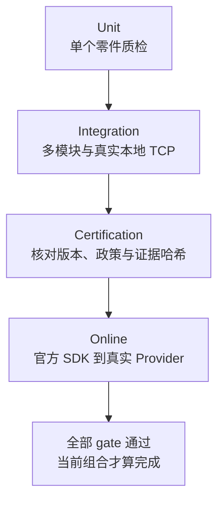

## 10.1 五层验证

> **小白理解：** 五层不是重复做同一件事。Unit 回答“一个转换规则对不对”，
> Integration 回答“模块接线对不对”，Certification 回答“现在启动的是不是测试过的
> 那套组合”，Distribution 回答“真实 tarball/node_modules 能否加载”，Online 回答
> “真实客户端与上游是否也按协议工作”。日常测试不会花在线额度。

| 层次 | 目的 | 代表文件 | 是否访问真实 CommandCode |
| --- | --- | --- | --- |
| Unit | 单个 parser/converter/assembler/lifecycle invariant | `test/unit/*.test.ts` | 否 |
| Integration | 多模块真实路径、fixture transport、真实 TCP/SDK/CLI subprocess | `test/integration/*.test.ts` | 否；只在最外部 fetch boundary 注入 fixture |
| Certification | spec hash、immutable conformance record、serving composition identity | `test/certification/*.test.mjs` | 否 |
| Distribution | workspace build/pack、干净临时安装、真实 `node_modules` 动态加载 | `test/distribution/package-smoke.test.mjs` | 否 |
| Online | direct Pi IR + Anthropic/Responses + Codex CLI/Claude Code + 真实 CommandCode | `test/online/*` | 是，五组显式命令 |

普通 `npm test` 不读取真实 key、不自动产生费用。Online runner 独立读取被忽略的
`CommandcodeAPIKey.txt`，默认模型是 `commandcode-private/deepseek/deepseek-v4-flash`，保存脱敏的完整
wire evidence。

## 10.2 Semantic coverage ownership

> **小白理解：** 每类故障都有明确负责的测试。例如拼错 JSONL 由 Provider 拼装测试
> 抓，客户端断线由 HTTP 测试抓，项目目录是否真的到达外部请求由在线测试抓。这样
> 一次失败能指出哪个部门出问题，而不是只留下“端到端失败”。

Immutable serving conformance record 把当前 route 分成这些维度：

```text
inbound grammar and semantics
Pi invocation integrity
Provider request/response conversion
cancellation and terminal consistency
outbound JSON and Atomic SSE
next-turn thinking/tool round trip
serving readiness and isolation
real loopback HTTP boundary
Pi config/credential/CLI
real Provider online conformance
per-Client-Protocol Auth isolation
```

这样失败能定位到 owning boundary，而不是只有一个“端到端失败”。例如：

- malformed JSONL/unknown event/EOF fault 由 deterministic assembler tests 拥有；
- socket disconnect/server shutdown 由 HTTP integration 拥有；
- Auth snapshot rotation/restart 由 real TCP official SDK test 拥有；
- global/project facts 到真实 Provider request 的传播由 online conformance 拥有；
- healthy upstream 无法稳定制造的 protocol fault 不伪造成 online case。

## 10.3 Online 测试的数据路径与当前证据

> **小白理解：** 在线测试走的就是用户实际路径：官方 Anthropic SDK 连接本地端口，
> 穿过正式 Runtime、Auth、Pi 和 Provider，最后访问真实 CommandCode。捕获器只坐在
> 最外侧网络出口复印证据，不替换 LuckyToken 内部模块。

```text
official Anthropic SDK / Codex CLI / Claude Code
→ real loopback TCP
→ production Runtime/Auth/Client Protocol/Pi
→ installed CommandCode Provider (registered at startup by the generic loader)
→ capturing fetch wrapper
→ real https://api.commandcode.ai
```

Capturing wrapper 位于 Provider 的 external transport boundary，不 mock LuckyToken 内部
模块。Evidence 包含 Client request/result/SSE events、Pi→Provider request、完整 raw
Provider JSONL 和 physical EOF。Secret 值不得出现在 artifact；summary 只记录数量、
失败分类和 latency。

2026-08-14 Distribution certification 记录为 `online-passed`：Direct Pi IR 23/23、
Anthropic 60/60、OpenAI Responses 60/60、Codex CLI 60/60（20 场景 × 3）、Claude
Code 51/51（17 场景 × 3）。Codex CLI 版本为 `0.147.0`，Claude Code 为 `2.1.210`。
脱敏摘要保存在 `test/fixtures/certification/online-validation-2026-08-14.json`，详细
artifacts 位于被忽略的 `.online-artifacts/`。Direct probe 从 package factory 导入；
其余套件通过通用 loader 从 `node_modules` 加载，不回退到旧源码 import。

## 10.4 完成 gate

> **小白理解：** Gate 是发布前必须全部打勾的清单：功能测试、类型检查、代码规范、
> 构建、文本差异检查和真实在线测试。修改协议或装配身份时，还要更新认证证据；不能
> 只让某几个单元测试通过就宣布完成。

当前 serving composition 的固定 gate 是：

```powershell
npm test
npm run typecheck
npm run lint
npm run build
npm run test:distribution
git diff --check
npx tsx test/online/pi-commandcode-ir-probe.ts
npm run test:online
npm run test:online-responses
npm run test:online-codex -- 3
npm run test:online-claude -- 3
```

涉及协议、Pi revision、Provider model/endpoint、Auth policy 或 serving boundary 的修改
还必须更新对应 conformance record/hash，不能只让普通 unit tests 变绿。

---

# 11. 对 AGENTS.md 设计原则的审计

## 11.0 小白导读：用建筑规范检查这座房子

`AGENTS.md` 像项目的建筑规范：不只要求今天能运行，还要求每个房间用途清楚、管线
不乱穿、以后增建时不会牵动整栋楼。本章把抽象原则对应到实际模块，并列出仍需长期
关注的结构压力。

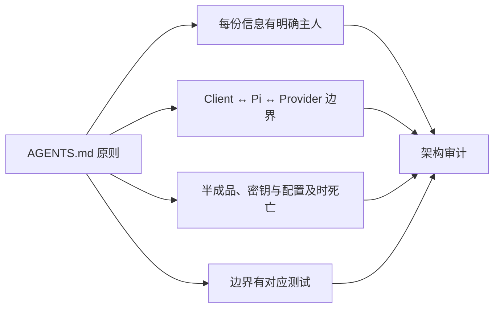

## 11.1 符合性矩阵

> **小白理解：** 这张表把“高内聚、低耦合”变成可以核查的证据，而不是口号。比如
> 两个协议目录是否互相 import、Runtime 接口是否足够小、半截工具调用是否会逃出
> owner，都是能从代码和测试中直接验证的事实。

| 原则 | 当前实现证据 | 结论 |
| --- | --- | --- |
| Pi 是唯一左右语义边界 | Anthropic/Responses 与 CommandCode package 零互相 import；共同语义类型只来自 Pi | 符合 |
| High cohesion / low coupling | 两个 Client Protocol、Client Auth、Pi config/credential、Provider Package 各自拥有行为+状态+测试 | 符合 |
| Capability cohesion | token schema/mutation/authority 在一个模块；Provider JSONL state 全在 Provider 目录 | 符合 |
| Small contracts | Runtime 只有 `handle(Request)`；handler 只有 method/path/handle；Auth 只有 `resolve(headers)` | 符合 |
| Information lifecycle | raw token/file JSON/Client Wire/Provider JSONL 都有明确死亡点；只传播窄 Pi facts | 符合 |
| 模型单一权威来源 | CommandCode 33 个模型只存在于 `models.ts`（官方 1.9.0 数据）；无运行时端点拉取、无第二份模型清单 | 符合 |
| `pi-agent/` 不可变 | 整个 `pi-agent/` 树（源码/生成物/配置/依赖）零修改；只通过 public `Models/Provider/CredentialStore` 接入；上游更新整体替换 | 符合 |
| HTTP failure 信息边界 | Provider 在自己的 transport boundary 有界产生 neutral fact；conversion 只消费 Pi diagnostic，handler 不注入 custom fetch；native passthrough 另用窄 transport | 符合 |
| Streaming lifecycle | Pi/CommandCode/Anthropic 三种 lifecycle 分开；EOF 不等于 success；partial tool state 不 materialize | 符合 |
| Tool identity | 两侧转换都保留 call ID/name/correlation；不按位置猜测 | 符合 |
| Cancellation | socket→HTTP→Pi→Provider→fetch/reader/retry 全链传播；commit 前仍 authoritative | 符合 |
| Configuration ownership | deployment、Client Auth、Pi model、Pi credential 分文件分 owner | 符合 |
| No unnecessary Manager/IR | 没有 service locator、Provider registry wrapper、universal request DTO 或第二 IR | 符合 |

## 11.2 Composition root 为什么可以看见两侧

> **小白理解：** 装配工必须同时看见插头和插座，才能把它们接起来；这不等于装配工
> 可以替两边处理业务。`composition.ts` 可以创建 Client Protocol、Pi 和通用 package loader，
> 但不能写“看到某个 Anthropic 字段就生成某个 CommandCode 字段”的翻译规则。

`composition.ts` import 两个 Client Protocol handler、Pi catalog、Provider Package
Contract/loader，但不 import CommandCode 实现。它只做 construction、通用动态加载、
registration 和 provider-neutral certification，没有 message/content/usage/tool conversion。

判断它是否越界的标准是：

```text
允许：create A, create B, inject Pi Models, bind Auth, certify facts
禁止：if Anthropic field X then emit CommandCode field Y
```

当前代码属于前者。

## 11.3 需要持续关注的边界压力

> **小白理解：** 这些项目不是偷偷欠下的 bug，而是已经明确选择的取舍。例如 Atomic
> SSE 更安全但不是实时吐字，package 动态加载也刻意不扩展为插件市场。未来改变取舍
> 时，应在真正拥有该功能的模块内演进，不能用跨层捷径绕过去。

这些不是被隐藏的功能，而是当前明确 trade-off：

1. **Atomic SSE 不是实时 token streaming。** 完整 Provider result 先 commit，再生成
   全部 Anthropic SSE bytes。优点是错误/取消可以原子 rollback；代价是首 token latency
   和完整 body buffering。若未来要求 progressive streaming，必须重新设计跨三层
   terminal/rollback contract，不能在 `server.ts` 里简单 pipe chunks。

2. **Provider Package loader 只支持显式配置的 npm 根包。** 不自动扫描、安装、热加载，
   也不提供插件市场。新增 Provider 应实现同一个 package seam，让通用 loader 返回
   标准 Pi Provider，而不是把 `composition.ts` 扩成 provider-specific switch。

3. **Client token mutation 按非并发 administrative operation 设计。** 没有 watcher/
   lock；运行 snapshot 不热更新。当前写入是该 capability 内的直接文件写，进程在写入
   中途崩溃可能留下损坏文件，但下一次启动会 fail closed。若产品需要 crash-atomic
   durability，应只在 `file-token-store.ts` 内增加原子替换，不改变 Auth/Runtime。

4. **Provider factory 的程序化 seam 允许 global fetch fallback。** Certified CLI
   composition 总是 bound fetch 并认证 `globalFetchFallback=prohibited`。其他嵌入方如果
   直接构造 Provider，应显式绑定 fetch，避免 ambient transport。

5. **Client→Pi 可表达不等于当前 Provider 端到端可表达。** 例如 Anthropic
   `strict:true` 可转换为 Pi constrained sampling；CommandCode Provider 按冻结例外将其
   降为普通工具并产生 degradation notice，但不宣称 strict 生效。Image 是否可用仍取决于
   selected model capability；不能把字段到达 Pi 当成具体 Provider 已执行该能力的证据。

6. **Pi CredentialStore 的 file lock 不能被复制到所有 JSON 文件。** 它解决的是
   concurrent OAuth refresh/login/logout；Client token CLI 没有同样并发需求。是否加锁
   必须由 capability 自己的真实 lifecycle 决定。

7. **Recognized 与 future-unknown 必须分开处理。** 已识别 Anthropic 字段按冻结方法
   direct map、omit+notice/degrade 或 fail；例如 `top_p` 与 thinking budget 进入 Pi，
   `tool_choice` 没有 Pi 表示时不得伪造控制。未来未知字段只按 owning Client Protocol
   的 unknown-family policy 处理，不能猜语义或借 Provider 行为反推。CommandCode
   响应侧同理：只有规范定义的 content 生命周期进入 content，no-op/未知事件按
   Provider-owned policy 处理。

8. **Provider HTTP 错误只通过 neutral fact 选择性保真。** Provider 在自己的
   transport boundary 有界采集并清洗 status、safe message/type/code、snapshot metadata
   与固定 allowlist headers；Client renderer 只消费 `ExecutionFailure.failure`，不读取
   原始 body。没有 trusted structured fact 时固定 generic 502，不能以 Pi
   `errorMessage` 猜测分类。Native passthrough 的 wire fidelity 属于独立 profile，不能
   用来放宽 conversion failure boundary。

## 11.4 用于代码评审的边界问题

> **小白理解：** 这八个问题是一张维护者检查表。哪怕不会读完整实现，也可以追问：
> 信息从哪里来、谁真正需要、什么时候销毁；某个新功能是否越过 Pi 直接把客户协议
> 接到 Provider。答不清楚时，通常说明模块职责还没有整理好。

修改任何模块时可以按顺序问：

1. 这个 fact 的 producer、carrier、semantic consumer、death point 分别是谁？
2. 新 import 是否跨过 Pi，直接连接一个 Client Protocol 与 concrete Provider？
3. 是否把完整 config/request/store 交给了只需要一个字段的模块？
4. 新 persistent state 是否放在真正拥有其 mutation/lifecycle 的 capability 中？
5. partial stream/tool state 是否可能在 terminal 前逃离 owner？
6. abort 后是否还可能写 response、重试或提交 partial result？
7. 新 abstraction 是否解决已证明的重复/变化，还是只为未来假设？
8. 对应 boundary 是否有 unit、integration 和必要的 real-wire evidence？

---

# 12. 正确扩展方式

## 12.0 小白导读：新增一条线路，不改坏旧线路

好的模块边界意味着增加新协议或 Provider 时，主要工作发生在一个新目录和启动接线
处，而不是到处加入 `if`。下面每节都列出“应该新增什么”和“绝对不该修改什么”，
相当于未来扩建施工图。

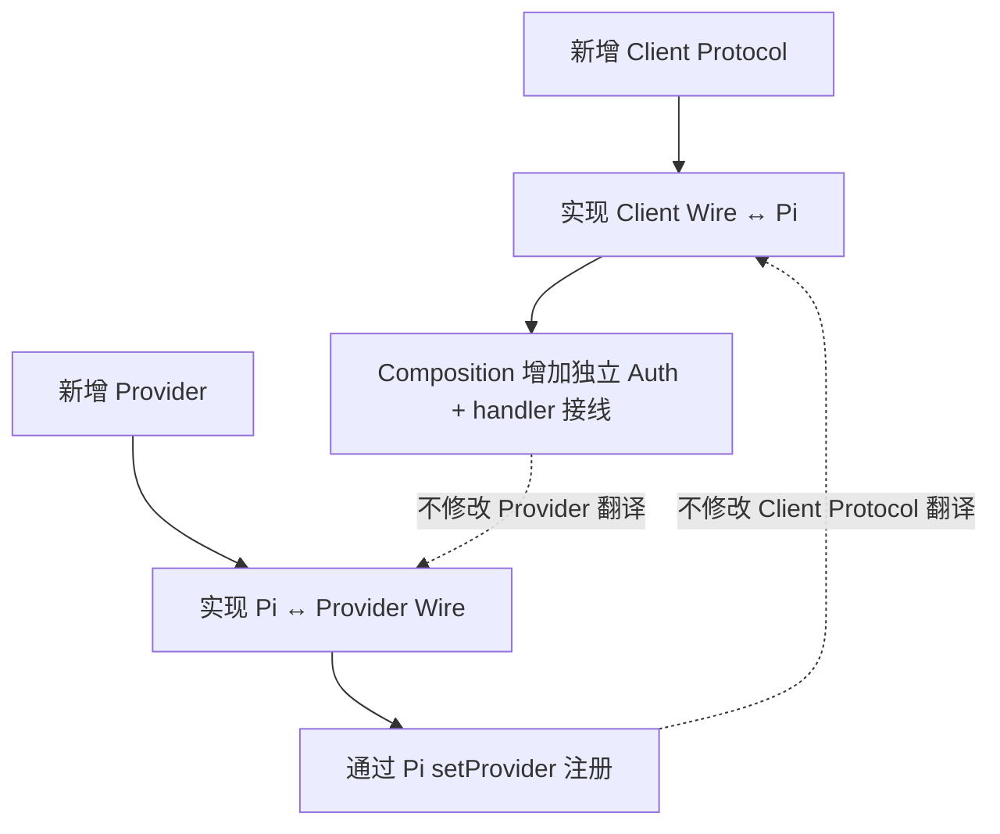

## 12.1 增加新的 Client Protocol

> **小白理解：** 新 Client Protocol 应当像新开一扇独立服务门：有自己的路由、解析、
> 返回格式、门卡文件和测试，只在中间使用相同 Pi 插座。它不能借用已有协议的
> 门卡或让 Runtime 把协议名称塞进通用 Auth。

现有 OpenAI Responses 实现是可复用的结构模板；新增另一协议时应新增平行目录：

```text
src/protocols/<new-client-protocol>/
  profile/request/options/response/stream/handler...

.luckytoken/client-auth/<new-client-protocol>.json

composition binding:
  protocol ID → its auth file → its Auth → its handler

tests:
  new Client wire ↔ Pi + route/Auth isolation + SDK/TCP
```

不得修改：

```text
concrete Provider conversion
existing Client Protocol parser/renderer/token files
generic Auth.resolve signature
Runtime to pass a protocol ID into Auth
Pi public contracts
```

Runtime 只需多注册一个独立 method/path handler。

## 12.2 增加新的 Private Provider

> **小白理解：** 新 Provider 像增加一家供应商专员：实现 Pi 要求的模型、登录和执行
> 接口，再在启动时登记。Anthropic 或 OpenAI 模块不需要增加“如果是这家供应商”
> 的判断，因此所有已存在的 Client Protocol 都能自动通过 Pi 使用它。

应实现一个新的 Pi `Provider` capability：

```text
Pi Context/Options → concrete upstream request
concrete upstream lifecycle → Pi AssistantMessageEventStream
Provider.auth
Provider.getModels()
```

将它包装为根入口固定导出 `providerPackage` 的 workspace/npm 包，依赖
`@luckytoken/provider-contract/package`，并在 `providerPackages` 中以 npm 根包名配置。
通用 loader 会完成版本/Provider 验证、冲突预检和 Pi 注册；无需修改 composition 或
增加 provider-specific 分支。静态 model config、credential method、request/response
conversion、retry/cancel/online conformance 仍由新包独立拥有和测试。不得修改
Anthropic/OpenAI adapters 来识别该 Provider。

## 12.3 增加更多 CommandCode models

> **小白理解：** 多模型主要是“目录和选择”问题，不应重新发明 CommandCode 协议
> 翻译。先让 Pi 的模型目录、名称消歧、Provider catalog 和认证清单支持多项；实际
> 请求仍携带已经选定的那个 Pi `Model`。

当前 33 个 CommandCode models 的唯一权威来源是 Provider Package 的 `models.ts`。
增删模型只应修改 package-owned catalog、model resolution/certification 期望及对应
测试；不需要在 `models.json` 复制条目。CommandCode wire conversion 应继续只消费
invocation 中已 resolved 的 `Model`。

## 12.4 更新 Pi

> **小白理解：** Pi 是项目中间的标准接口，升级它像更换整座建筑的统一插座标准：
> 先更新正式依赖并审查上游参考源码，再核对两侧接口和全部测试。不要为了省事直接
> 修改仓库中的 Pi 参考副本，否则以后无法清楚同步上游。

1. 更新 npm dependency/审查对应 `pi-agent/packages/ai` upstream snapshot；
2. 不在 vendored package 中加入 LuckyToken patch；
3. 重新核对 `Models/Provider/CredentialStore/EventStream` public contracts；
4. 运行 Pi runtime fidelity 和所有两侧 conversion tests；
5. 更新 Pi protocol evidence、integrity 与 serving certification hash。

## 12.5 替换文件存储

> **小白理解：** 存储方式可以从 JSON 换成数据库或其他介质，但对相邻模块展示的
> 小接口应保持不变。换 Client Token 存储不该动 Provider 登录，换 Provider 凭证
> 存储不该动 Client Auth；这样更换一个抽屉不会污染整间办公室。

- 替换 Client token persistence：保持 `ClientTokenAuthority` 与
  `FileClientTokenStore` 等价窄 seam，只改该 capability 和 composition binding；
- 替换 Pi credential persistence：实现 Pi `CredentialStore`，不改 Provider login 或
  Client Auth；
- 替换 deployment config format：仍然在 composition 前结束完整 config lifecycle，
  下游只接收窄 constructor facts。

---

# 13. 阅读顺序

## 13.0 小白导读：三条阅读路线

不需要从第一行读到最后一行。根据目的选择一条路线：

```mermaid
flowchart TB
    Q{"你想了解什么？"}
    Q -->|"项目总体做什么"| A["先读 1、2、8、11 章"]
    Q -->|"一次请求怎么走"| B["读 3 → 4 → 5 → 6 → 7 章"]
    Q -->|"以后怎样扩展"| C["读 9、11、12 章"]
    B --> D["再按本节源码顺序核对"]
```

零编程经验的读者可以只读每章的 `X.0 小白导读`、所有“小白理解”旁注和 Mermaid
图；需要做技术判断时，再阅读紧随其后的原接口、表格和不变量。两条阅读层描述的是
同一套系统，不是两个不同设计。

如果要判断一个实际请求是否符合架构，建议按这条顺序阅读：

> **小白理解：** 下面顺序像沿着包裹追踪记录逐站检查：先看服务如何组装，再看请求
> 怎样进入和认证，然后看两次翻译与中间 Pi 接口，最后用规范和测试核对。不要只盯着
> 某个代码片段猜整条链路。

1. `src/cli.ts` 与 `src/composition.ts`：对象如何构造；
2. `src/server.ts` → `runtime.ts` → `http.ts`：请求如何进入/取消；
3. `src/auth.ts` 与 `src/client-auth/file-token-store.ts`：谁被授权、产生什么窄事实；
4. `src/protocols/anthropic/handler.ts`，再分别进入 request/options/response/SSE；
5. Pi `Models.streamSimple()` public contract；
6. `src/providers/package-loader.ts` → `@luckytoken/provider-commandcode-private` →
   `provider.ts` → project/attempts/assembler/semantic；
7. 对应 Protocol/Conversion Spec；
8. owning unit/integration test、serving conformance record，以及深度在线证据
   （`test/online/deep-online.ts`、`test/online/event-coverage.ts`）——后者证明
   真实上游上"Anthropic 只转换指定字段、CommandCode 只有指定 event 进 content"。

不要从 `composition.ts` 的同时 import 两侧推断存在“Anthropic→CommandCode
converter”；真正的数据转换必须分别在 Client Protocol 与 Provider boundary 中找到。
