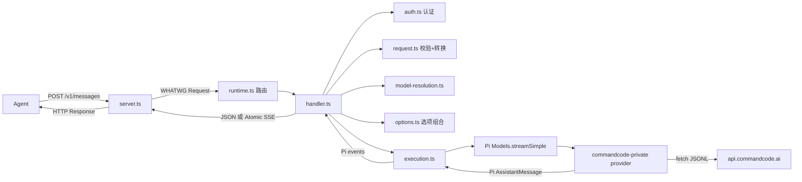

# LuckyToken 项目分析 / Project Analysis

**文档性质：** 对 LuckyToken 项目的一份整体性认识与地图（overview & map），
面向新读者、维护者与 Agent 的快速上下文建立。<br>
**对应代码：** `src/` 生产路径，Node.js 22.19+，TypeScript，Pi AI 0.84.1<br>
**源码基线：** commit `46db639`（2026-08-11）<br>
**权威规范：** [LuckyTokenCoreSpec](./Spec/LuckyTokenCoreSpec.md) 拥有
architecture/ownership；[LuckyTokenArchitecture](./LuckyTokenArchitecture.md) 是
实现架构说明。<br>
**设计约束：** [AGENTS.md](../AGENTS.md)

> 本文是「先读什么、项目做什么、模块怎么连」的导览，不替代也不复制
> `LuckyTokenArchitecture.md` 的逐模块接口说明。若本文与权威规范冲突，
> 以权威规范为准，并请在 owning authority 修复。

---

## 1. 一句话认识 / One-liner

**LuckyToken 是一个本地模型协议桥 / 路由器（protocol bridge / router）。**

它对外暴露一个 **Anthropic Messages API** 的 HTTP 端点
（`POST /v1/messages`，默认监听 `127.0.0.1:3000`），任何支持自定义 base URL 的
Agent 都可以通过它访问远程模型服务 —— 目前是 **CommandCode Private**
（`https://api.commandcode.ai/alpha/generate`）—— 而 Agent 无需知道上游的
wire format。

```
English: LuckyToken is a local model protocol bridge/router. It exposes an
Anthropic Messages API endpoint (POST /v1/messages, default 127.0.0.1:3000) so
that any Agent supporting a custom Anthropic base URL can talk to a remote model
service (currently CommandCode Private) without knowing its wire format.
```

---

## 2. 核心架构原则 / Core Architecture Principle

**Pi AI IR 是唯一的语义边界（single semantic boundary），两边互不可知。**

```text
Client Wire (Anthropic)
    ↕
Client Protocol adapter        (src/protocols/anthropic/)
    ↕
Pi runtime contracts           (Models, Context, ModelsSimpleStreamOptions, ...)
    ↕
Provider adapter               (src/providers/commandcode-private/)
    ↕
Upstream Wire (CommandCode JSONL)
```

- **Client Protocol adapter** 只拥有 `Client Wire ↔ Pi` 转换，不得导入/命名/决策任何
  Provider 或上游协议。
- **Provider adapter** 只拥有 `Pi ↔ Upstream` 转换，不得导入/命名/决策任何
  Anthropic、OpenAI Responses 或其他 Client Protocol。
- **Runtime 与 HTTP 路由** 只做协调，不得吸收任何一方的语义策略。
- 新增/替换/删除 Client Protocol 不应要求 Provider 改动；反之亦然。
- 不允许创建跨侧转换、共享协议 DTO 或第二个 IR 来绕过 Pi。

> 这份原则对应 `AGENTS.md` 的「Pi IR boundary is the first principle」，
> 是整个代码库最不可破坏的边界。

---

## 3. 端到端请求流程 / End-to-End Request Flow



1. Agent → `POST /v1/messages`（Anthropic JSON）→ `server.ts` 把 Node
   `IncomingMessage` 适配为 WHATWG `Request`。
2. `runtime.ts` 按 method+path 精确选择 Client Protocol handler。
3. `handler.ts`：内容类型 → Auth（`Authorization: Bearer` 或 `x-api-key`）→
   `anthropic-version` profile → 读取 body（有字节上限）→ 严格校验 →
   `resolveModel` → model-aware 有效性 → 转换为 Pi `Context` + 选项 →
   `freezePiInvocation` → `execute`。
4. `execute` → Pi `Models.streamSimple` → `commandcode-private` provider →
   `prepareCommandCodeRequest` → `fetch` 上游 JSONL → 原子事件组装 →
   语义转换为 Pi `AssistantMessage`。
5. handler 渲染 **JSON**（非流式）或 **Atomic SSE**（流式）→ `server.ts` →
   Agent。

---

## 4. 模块地图 / Module Map

### 4.1 Transport 与 Runtime

| 文件 | 职责 |
| --- | --- |
| `src/server.ts` | Node `http` listener；`IncomingMessage` ↔ WHATWG `Request/Response` 适配；跟踪活动请求；幂等 `close()` |
| `src/runtime.ts` | `createLuckyTokenRuntime`：冻结 `ClientProtocolHandler[]` 为路由表（method+path），只暴露 `handle(Request)` |
| `src/http.ts` | 精确路由选择；组合 AbortController（断连+关闭+超时）；`markDelivered` 单次投递；404 / 500 |
| `src/execution.ts` | 消费 Pi `streamSimple` 事件；要求显式语义终态（`done` 或 `error`）；`deferred` 不支持；区分中止/失败/畸形流 |

### 4.2 Client Auth（按协议隔离）

| 文件 | 职责 |
| --- | --- |
| `src/auth.ts` | 通用 `createAuth`：解析一个 Bearer / x-api-key 凭证，调用注入的 `authorizeToken`，产出 `{ sessionId, projectDir? }`；协议无关，每个 handler 一个实例 |
| `src/client-auth/file-token-store.ts` | 客户端 token 文件存储（`luckytoken-client-auth-v1`），global + projects 作用域，0600/0700 权限 |
| `src/client-auth/cli.ts` | `client-token` 子命令 CLI |

**信息生命周期**：认证后，raw 凭证 / token 作用域 / 文件路径即终结；只有
`sessionId` 与 `projectDir?` 继续进入 Pi 选项组合。

### 4.3 Anthropic Client Protocol（`src/protocols/anthropic/`）

| 文件 | 职责 |
| --- | --- |
| `handler.ts` | 请求生命周期编排；错误映射（400/401/404/413/415/500，Anthropic 错误形状） |
| `request.ts` | 顶层字段严格白名单；content block 校验；工具轮次生命周期；历史规范化；→ Pi `Context` |
| `tools.ts` | 工具 JSON-Schema 子集校验；`strict` → Pi `constrainedSampling` |
| `options.ts` | 闭世界选项组合；只允许 `maxTokens/temperature/metadata.user_id` |
| `representability.ts` | model-aware 有效性：图像能力门、最终 assistant 前缀分类、思考需 reasoning 模型 |
| `response.ts` | Pi `AssistantMessage` → Anthropic Message；严格保真断言 |
| `sse.ts` | **Atomic SSE**：先完整提交结果，再渲染 `message_start → content_block_* → message_delta → message_stop` |
| `wire.ts` | 目标 schema 断言；JSON 成功 / 错误渲染 |

### 4.4 Pi 集成与 Composition

| 文件 | 职责 |
| --- | --- |
| `src/pi/model-config.ts` | `models.json` 快照加载（JSONC，字段白名单）；绝不读凭证 |
| `src/pi/file-credential-store.ts` | Pi `CredentialStore` 实现（proper-lockfile + 重试，0600/0700）；`.luckytoken/pi/auth.json` 唯一运行时所有者 |
| `src/composition.ts` | 组合根：构建 Pi `Models`、注册 provider、绑定 Auth、跑 serving certification（CERTIFIED 才启动） |
| `src/cli-config.ts` | 严格配置 schema；相对路径解析；auth-file 唯一性 |
| `src/model-resolution.ts` | `provider/id` 限定名与裸 `id` 查找，歧义报错 |
| `src/commandcode-serving-certification.ts` | 冻结 serving manifest（规范身份+sha256、策略、覆盖率、验证命令、`SERVING_CONFORMANCE_REVISION`），漂移即失败关闭 |

### 4.5 CommandCode Private Provider（`src/providers/commandcode-private/`）

| 文件 | 职责 |
| --- | --- |
| `provider.ts` | Pi `Provider`：`auth.apiKey` + `api.stream/streamSimple`；构建请求、校验、执行尝试、重放 Pi 事件；`x-command-code-version: 1.9.0` 等头部 |
| `project.ts` | `projectDir` 快照 → CommandCode `config`（git 分支/状态/提交，工作区作用域） |
| `assembler.ts` | 原子 JSONL 事件组装（text/reasoning/tool 槽按 id 键控，生命周期校验，usage 归一化） |
| `attempts.ts` | 重试策略（retry-after / 指数退避 / 上限），尝试级 AbortController，traceparent |
| `semantic.ts` | CommandCode 结果 → Pi `AssistantMessage`（usage 对账、reasoning→thinking、工具调用克隆、stop-reason 映射） |
| `json.ts` | 严格无损 JSON 克隆 |

---

## 5. 测试、Certification 与证据 / Tests, Certification & Evidence

| 层 | 位置 / 命令 | 说明 |
| --- | --- | --- |
| Unit | `test/unit/`（31 文件） | 纯函数与单模块行为 |
| Integration | `test/integration/`（24 文件） | 注入 fixture `fetch`，不访问真实服务 |
| Certification | `test/certification/*.test.mjs`，`node --test` | 哈希锁定规范身份与 serving manifest，漂移即失败 |
| Online | `test/online/`，`npm run test:online` | 需授权；真实 loopback 监听 + 官方 Anthropic SDK；证据写入 `.online-artifacts/` |

- `npm test` = certification + vitest run。
- `npm run typecheck` / `lint` / `build` 分别用 tsconfig / eslint / tsconfig.build。

---

## 6. 当前状态与已知取舍 / Current State & Known Trade-offs

- 无 `TODO` / `FIXME` 残留；认证范围内功能完整（Ticket 01–28 全部完成）。
- **Atomic SSE 而非实时流**：先完整提交上游结果再渲染 SSE；首 token 延迟与全量
  缓冲被接受（有意的取舍，非 bug）。
- 单一安装的 Client Protocol（anthropic-messages）与单一认证模型；扩展需新绑定，
  不是 composition 里的中央 switch。
- Client token 变更是非并发管理操作；运行时使用不可变启动快照（改后需重启）。
- 程序化 Provider seam 允许 ambient `global.fetch` 回退，但认证 CLI 组合绑定 fetch
  且 `globalFetchFallback=prohibited`。
- Client→Pi 可表达 ≠ Provider 端到端可表达：如 Anthropic `strict:true` 可转换为
  Pi constrained sampling，但 CommandCode Provider 拒绝 required strict 语义；
  图像保真不在默认认证策略内 → 显式 fail-closed，绝不静默丢字段。
- CommandCode 侧无损缺口：`responseModel/responseId` 省略；部分
  `rawFinishReason` 值与 server-executed/dynamic tools 失败关闭。

### 未跟踪文件提示 / Untracked-file note

`doc/Protocols/PI AI IR-Commandcode Private Conversion.md` 目前**未跟踪**、不在
certification 链内，风格是工作笔记式转换教程。其中 §1.3 与
`src/providers/commandcode-private/provider.ts` 的 `prepareCommandCodeRequest`
端点构造行为存在一处不一致（关于 `new URL("/alpha/generate", model.baseUrl)`
是否重置已有 path）。按 AGENTS.md 规则，此类冲突应先报告、在 owning authority
修复，而不是静默调和。

---

## 7. 推荐阅读顺序 / Suggested Reading Order

1. [AGENTS.md](../AGENTS.md) —— 工作原则与不可破坏的边界；
2. [README.md](../README.md) —— 安装、配置、登录、运行；
3. [LuckyTokenArchitecture.md](./LuckyTokenArchitecture.md) —— 实现架构地图
   （含小白导读）；
4. [LuckyTokenCoreSpec.md](./Spec/LuckyTokenCoreSpec.md) —— 规范性架构；
5. [HANDOFF.md](./HANDOFF.md) —— 交接基线；
6. 涉及协议时再进入 [Protocols](./Protocols/) 下的 Protocol Spec 与
   Conversion Method；
7. 需要修改代码时按需查阅 `src/` 对应模块与 `test/` 对应测试。

---

*本文基于对 `46db639` 源码基线的整体分析整理；如与权威规范冲突，以权威规范为准。*
