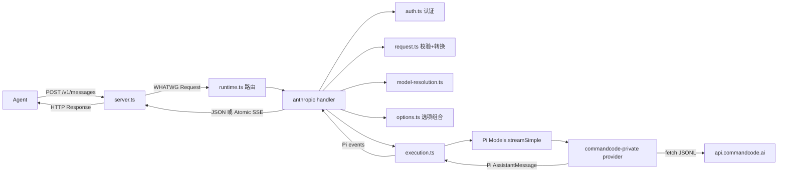
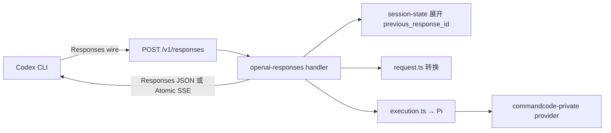

# LuckyToken 项目分析 / Project Analysis

**文档性质：** 对 LuckyToken 项目的一份整体性认识与地图（overview & map），
面向新读者、维护者与 Agent 的快速上下文建立。<br>
**对应代码：** `src/` Core 与 `packages/` Provider Package 生产路径，Node.js 22.19+，TypeScript，Pi AI 0.84.1<br>
**源码基线：** commit `41007a5`（2026-08-14，CommandCode Provider Package）<br>
**权威规范：** [LuckyTokenCoreSpec](./Spec/LuckyTokenCoreSpec.md) 拥有
architecture/ownership；[LuckyTokenArchitecture](./LuckyTokenArchitecture.md) 是
实现架构说明。<br>
**历史交接：** [HANDOFF.md](./HANDOFF.md)（2026-08-12 快照，不是当前 authority）<br>
**设计约束：** [AGENTS.md](../AGENTS.md)

> 本文是「先读什么、项目做什么、模块怎么连」的导览，不替代也不复制
> `LuckyTokenArchitecture.md` 的逐模块接口说明。若本文与权威规范冲突，
> 以权威规范为准，并请在 owning authority 修复。

---

## 1. 一句话认识 / One-liner

**LuckyToken 是一个本地模型协议桥 / 路由器（protocol bridge / router）。**

它对外暴露 **两个 Client Protocol 端点** 和一个共享模型发现端点（默认监听
`127.0.0.1:3000`）：

- `POST /v1/messages` — Anthropic Messages API；
- `POST /v1/responses` — OpenAI Responses API（可选，Codex 客户端）；
- `GET /v1/models` — 无认证的跨协议模型发现（只暴露 LuckyToken 自有 provider）。

任何支持自定义 base URL 的 Agent（Claude Code、Codex 等）都可以通过它访问远程
模型服务——目前是 **CommandCode Private**（`https://api.commandcode.ai/alpha/generate`）
——而 Agent 无需知道上游的 wire format。

```
English: LuckyToken is a local model protocol bridge/router. It exposes an
Anthropic Messages endpoint (POST /v1/messages), an optional OpenAI Responses
endpoint (POST /v1/responses), and unauthenticated model discovery
(GET /v1/models) so that any Agent supporting a custom base URL can talk to a
remote model service (currently CommandCode Private) without knowing its wire
format.
```

---

## 2. 核心架构原则 / Core Architecture Principle

**Pi AI IR 是唯一的语义边界（single semantic boundary），两边互不可知。**

```text
Client Wire (Anthropic / OpenAI Responses)
    ↕
Client Protocol adapter        (src/protocols/anthropic/ · src/protocols/openai-responses/)
    ↕
Pi runtime contracts           (Models, Context, ModelsSimpleStreamOptions, ...)
    ↕
Provider Package               (packages/provider-commandcode-private/)
    ↕
Upstream Wire (CommandCode JSONL)
```

- **Client Protocol adapter** 只拥有 `Client Wire ↔ Pi` 转换，不得导入/命名/决策任何
  Provider 或上游协议。
- **Provider adapter** 只拥有 `Pi ↔ Upstream` 转换，不得导入/命名/决策任何
  Anthropic、OpenAI Responses 或其他 Client Protocol。
- **Runtime 与 HTTP 路由** 只做协调，不得吸收任何一方的语义策略。
- 新增/替换/删除 Client Protocol 不应要求 Provider 改动；反之亦然。
- 不允许创建跨侧转换、共享协议 DTO 或第二个 IR 来绕过 Pi。
- `pi-agent/` 整棵树不可修改；生产依赖 `@earendil-works/pi-ai@0.84.1` 是
  Pi 公共契约的唯一来源。

> 这份原则对应 `AGENTS.md` 的「Pi IR boundary is the first principle」，
> 是整个代码库最不可破坏的边界。每个 Client Protocol 还有独立的 Auth 实例与
> 独立 token 文件；认证后只有 `sessionId` 与 `projectDir?` 继续进入 Pi 选项组合。

---

## 3. 端到端请求流程 / End-to-End Request Flow

### 3.1 Anthropic 通道 `POST /v1/messages`



1. Agent → `POST /v1/messages`（Anthropic JSON）→ `server.ts` 把 Node
   `IncomingMessage` 适配为 WHATWG `Request`。
2. `runtime.ts` 按 method+path 精确选择 Client Protocol handler。
3. `handler.ts`：内容类型 → Auth（`Authorization: Bearer` 或 `x-api-key`）→
   `anthropic-version` profile → 读取 body（有字节上限）→ 严格校验 →
   `resolveModel` → model-aware 有效性 → 转换为 Pi `Context` + 选项 →
   `freezePiInvocation` → `execute`。
4. `execute` → Pi `Models.streamSimple` → `commandcode-private` provider →
   `prepareCommandCodeRequest` → `fetch` 上游 JSONL → 原子事件组装 →
   语义转换为 Pi `AssistantMessage`。
5. handler 渲染 **JSON**（非流式）或 **Atomic SSE**（流式）→ `server.ts` →
   Agent。

> 若解析出的 model 的 `api` 是 `anthropic-messages`（例如 `models.json` 注册的
> 复用 Pi 内置 anthropic api adapter 的自定义 provider），handler 走
> `passthrough.ts`：把客户端原始 Anthropic 请求原样转发到该 provider 上游，并
> 原样返回响应（状态 + 头 + 体，成功与上游失败均 verbatim）。

### 3.2 OpenAI Responses 通道 `POST /v1/responses`（可选）



- Codex 发送「增量请求 + `previous_response_id`」；adapter 从磁盘快照展开完整历史，
  Provider 只看到展开后的完整 Pi 历史（历史拼接是 Client Protocol 的职责，不是第二 IR）。
- 会话历史**持久化到磁盘**（`stateFile`，默认 `<config-dir>/state/openai-responses.json`），
  重启后 Codex 续会话不丢。
- 会话状态语义：`store:false` 由 `honor|memory|persist` 策略决定（默认 `honor`）；
  unknown/expired/evicted/unresolvable `previous_response_id` 产生 typed conversion error；
  1000 条、24h TTL、单条 1000 items / 256KiB、32MB 快照解析上限、2s 防抖原子写
  （tmp+rename）、损坏快照备份 `.corrupt` 后空启动、shutdown flush。
- Codex 工具形状由 adapter 归一化：OpenAI 托管工具（`web_search`、`image_generation`）跳过、
  自由 `custom` 工具暴露为单输入函数、`namespace` 组扁平化、非对象 tool `parameters`
  包装为 JSON Schema 对象。
- SSE 为 Atomic 序列：`response.created → output_item.done ×N → response.completed → data: [DONE]`。

### 3.3 模型发现 `GET /v1/models`

- 无认证的跨协议元数据端点（`src/models-discovery.ts`），不绑定任何 Client Protocol 的 Auth。
- 只暴露本次由通用 loader 成功加载的 external Provider IDs；不硬编码 CommandCode。
- wire 格式（Responses list shape）由 `src/protocols/openai-responses/models.ts` 拥有；
  `models-discovery.ts` 只持有暴露策略。

---

## 4. 模块地图 / Module Map

### 4.1 Transport 与 Runtime

| 文件 | 职责 |
| --- | --- |
| `src/server.ts` | Node `http` listener；`IncomingMessage` ↔ WHATWG `Request/Response` 适配；跟踪活动请求；幂等 `close()` |
| `src/runtime.ts` | `createLuckyTokenRuntime`：冻结 `ClientProtocolHandler[]` 为路由表（method+path），只暴露 `handle(Request)` 与 `routes` |
| `src/http.ts` | 精确路由选择；组合 AbortController（断连+关闭+超时）；`markDelivered` 单次投递；404 / 500 |
| `src/execution.ts` | 消费 Pi `streamSimple` 事件；要求显式语义终态（`done` 或 `error`）；验证 neutral Pi failure diagnostic 并保存在 `ExecutionFailure.failure`；`deferred` 不支持；区分中止/失败/畸形流 |

### 4.2 Client Auth（按协议隔离）

| 文件 | 职责 |
| --- | --- |
| `src/auth.ts` | 通用 `createAuth`：解析一个 Bearer / x-api-key 凭证，调用注入的 `authorizeToken`，产出 `{ sessionId, projectDir? }`；协议无关，每个 handler 一个实例 |
| `src/client-auth/file-token-store.ts` | 客户端 token 文件存储（`luckytoken-client-auth-v1`），global + projects 作用域，0600/0700 权限 |
| `src/client-auth/cli.ts` | `client-token` 子命令 CLI |

**信息生命周期**：认证后，raw 凭证 / token 作用域 / 文件路径即终结；只有
`sessionId` 与 `projectDir?` 继续进入 Pi 选项组合。

### 4.3 Anthropic Client Protocol（`src/protocols/anthropic/`）

| 文件 | 职责 |
| --- | --- |
| `handler.ts` | 请求生命周期编排；conversion 不注入 custom fetch；只消费 trusted `ExecutionFailure.failure`，缺失时固定 generic 502；native passthrough 使用独立 `passthroughFetch` |
| `request.ts` | 顶层字段严格白名单；content block 校验；工具轮次生命周期；历史规范化；→ Pi `Context` |
| `tools.ts` | 工具 JSON-Schema 子集校验；`strict` → Pi `constrainedSampling` |
| `options.ts` | 闭世界选项组合；只允许 `maxTokens/temperature/metadata.user_id` 等窄字段 |
| `representability.ts` | model-aware 有效性：图像能力门、最终 assistant 前缀分类、思考需 reasoning 模型 |
| `profile.ts` / `failures.ts` | `anthropic-version` profile 解析；`InvalidRequest` / `UnsupportedFeature` 分类 |
| `passthrough.ts` | `anthropic-messages` api 模型的 native wire 转发分支；只接收独立窄 `passthroughFetch` |
| `response.ts` | Pi `AssistantMessage` → Anthropic Message；严格保真断言 |
| `sse.ts` | **Atomic SSE**：先完整提交结果，再渲染 `message_start → content_block_* → message_delta → message_stop` |
| `wire.ts` | 目标 schema 断言；JSON 成功 / 错误渲染 |
| `failure-rendering.ts` | 把 trusted neutral fact 映射为 Anthropic 错误 envelope；无 fact 不解析字符串 |

### 4.4 OpenAI Responses Client Protocol（`src/protocols/openai-responses/`）

| 文件 | 职责 |
| --- | --- |
| `handler.ts` | 请求生命周期编排；`previous_response_id` 展开；conversion 不注入 custom fetch；trusted neutral failure 映射与 generic 502 fallback；native 分支独立 transport |
| `request.ts` | Responses wire → Pi `Context`；Codex 工具形状归一化 |
| `response.ts` | Pi `AssistantMessage` → Responses response object（含 `previous_response_id` 链） |
| `sse.ts` | Responses Atomic SSE 渲染 |
| `passthrough.ts` | native Responses wire 转发；只接收独立窄 `passthroughFetch` |
| `session-state.ts` | 磁盘持久化会话快照（防污染、FIFO、原子写、corrupt 备份、shutdown flush） |
| `models.ts` | `/v1/models` 的 Responses wire shape |
| `index.ts` | 公共导出 |

### 4.5 共享协议层（中立，消除跨协议 import）

| 文件 | 职责 |
| --- | --- |
| `src/protocols/options.ts` | 中立的 `composeOptions`，Anthropic 与 OpenAI Responses 共用；只接收窄 invocation facts |
| `packages/provider-contract/src/diagnostics.ts` | Core 与外部 Provider Package 共享的 neutral failure/notices/attempts/execution facts 及 trusted runtime markers；不包含 Client-specific 映射 |

### 4.6 Pi 集成与 Composition

| 文件 | 职责 |
| --- | --- |
| `src/pi/file-credential-store.ts` | Pi `CredentialStore` 实现（proper-lockfile + 重试，0600/0700）；`.luckytoken/pi/auth.json` 唯一运行时所有者 |
| `src/composition.ts` | 组合根：构建 Pi `Models`，按 builtins → `models.json` → external packages 注册，绑定每个协议独立 Auth，运行 provider-neutral Core certification |
| `src/cli-config.ts` | 严格配置 schema；相对路径解析；auth-file 唯一性 |
| `src/model-resolution.ts` | `selectorTool`（parse/format）+ `resolveModel`：`provider/model_id` 第一斜杠约定，精确匹配、歧义报错 |
| `src/models-discovery.ts` | `GET /v1/models` 无认证发现端点；只接收 loader 返回的 external Provider IDs |
| `src/core-serving-certification.ts` | provider-neutral Core runtime certification；记录 Client Protocol、实际 Provider IDs、注册顺序与 limits |
| `src/cli.ts` | CLI：`serve` / `login` / `logout` / `client-token`；Pi `Provider.auth` 交互 |

### 4.7 Provider 层

| 文件 | 职责 |
| --- | --- |
| `packages/provider-contract/` | 版本化 Provider Package 构造 seam，以及共享 diagnostics runtime；不创建第二套 registry 或 IR |
| `src/providers/catalog.ts` | 注册 Pi built-in providers 与 `models.json` providers；不 import 具体 external Provider |
| `src/providers/models-json.ts` / `models-json-schema.ts` | 用户自定义 provider（`baseUrl` + `api` + `apiKey` + `models`）解析与注册；不覆盖内置 provider id |
| `src/providers/package-loader.ts` | 从 npm 根包名动态导入固定 `providerPackage`，验证/暂存全部 Provider、预检冲突后原子注册，并返回 external IDs |
| `packages/provider-commandcode-private/src/provider.ts` | Pi `Provider`：`auth.apiKey` + `api.stream/streamSimple`；构建请求、校验、执行尝试、重放 Pi 事件；`x-command-code-version: 1.9.0` 等头部 |
| `packages/provider-commandcode-private/src/project.ts` | `projectDir` 快照 → CommandCode `config`（git 分支/状态/提交，工作区作用域） |
| `packages/provider-commandcode-private/src/assembler.ts` | 原子 JSONL 事件组装（text/reasoning/tool 槽按 id 键控，生命周期校验，usage 归一化） |
| `packages/provider-commandcode-private/src/attempts.ts` | 重试策略（retry-after / 指数退避 / 上限），尝试级 AbortController，traceparent |
| `packages/provider-commandcode-private/src/semantic.ts` | CommandCode 结果 → Pi `AssistantMessage`（usage 对账、reasoning→thinking、工具调用克隆、stop-reason 映射） |
| `packages/provider-commandcode-private/src/models.ts` / `model.ts` / `constants.ts` / `json.ts` | 33 个模型的唯一目录（官方 1.9.0 数据）；内置默认模型与 provider/api id；严格无损 JSON 克隆 |

---

## 5. 模型选择器约定 / Model Selector Convention

选择器采用 `provider/model_id` 约定：**第一个斜杠**把 selector 拆成 provider 与
model_id，model_id 本身可以包含斜杠。

- 内置默认模型 id 是 `deepseek/deepseek-v4-flash`，其完整限定 selector 为
  `commandcode-private/deepseek/deepseek-v4-flash`——与 Pi 内置 deepseek 的
  `deepseek/deepseek-v4-flash` 是**不同**选择器。
- 解析是精确的：限定名 → 目录精确匹配（`provider` + 完整 `model.id`）→ 裸 `model.id`
  兜底 → 歧义/未知显式失败，**无模糊回退**。
- 选择器字符串格式知识只集中在 `selectorTool.parse` / `selectorTool.format`
  （`src/model-resolution.ts`）；其他模块把 selector 当作不透明字符串传递、整体匹配或
  回显，绝不自行 split / join / trim / 正则。

---

## 6. 测试、Certification 与证据 / Tests, Certification & Evidence

| 层 | 位置 / 命令 | 说明 |
| --- | --- | --- |
| Unit | `test/unit/` | 纯函数与单模块行为 |
| Integration | `test/integration/` | 注入 fixture transport，不访问真实服务 |
| Certification | `test/certification/`，`node --test` | 哈希锁定规范身份、五个 profile、架构 import 边界与 serving manifest，漂移即失败 |
| Distribution | `npm run test:distribution` | pack 三个 workspace tarball，在干净临时目录从真实 `node_modules` 加载并运行 |
| Online | `test/online/`，五组命令 | direct IR、Anthropic、Responses、Codex CLI ×3、Claude Code ×3；证据写入 `.online-artifacts/` |

- `npm test` = certification + vitest run；Ticket 28 完成证据记录在对应 ticket 与
  `serving-conformance-v2.json`，避免在导览中固化易过期的测试数量。
- `npm run typecheck` / `lint` / `build` 分别用 tsconfig / eslint / tsconfig.build。
- online 套件显式运行、不纳入
  `npm test`；malformed/unknown/EOF/分块等故障注入留在确定性的离线用例中。

---

## 7. 当前状态与已知取舍 / Current State & Known Trade-offs

### 当前状态

- `main` 当前基线已将 CommandCode 实现交付为两个私有 workspace/npm 包，并通过
  通用 loader 从 `node_modules` 加载。
- 生产组合提供两个 Client Protocol + `GET /v1/models`；Anthropic 与 OpenAI Responses
  各自独立 Auth 实例与 token 文件，认证隔离已被测试锁定（anthropic token 打
  `/v1/responses` → 401，反之亦然）。
- 无 `TODO` / `FIXME` 残留；`.tickets/` 两个工作链
  （`refactor-2026-08` 14 项 + `openai-responses-2026-08` 5 项）标记为完成。
- `.luckytoken/`、所有 `auth.json`、`CommandcodeAPIKey.txt`、`.online-artifacts/`
  均被 `.gitignore` 排除。

### 已知取舍（显式记录，非 bug）

- **Atomic SSE 而非实时流**：先完整提交上游结果再渲染 SSE；首 token 延迟与全量
  缓冲被接受。Responses 与 Anthropic 两侧都是 Atomic。
- **`store:false` 由 Responses-owned policy 决定**：默认 `honor` 不写内存或磁盘；
  `memory` 与 `persist` 是显式配置模式，后者产生 request-local notice。
- **`/v1/models` 只暴露 loader 成功加载的 external Providers**；它不按 credential
  过滤，缺少 API key 只在真实调用时由 Pi auth path 报错。
- **单实例假设**：会话快照无跨进程锁；Client token 变更是非并发管理操作，运行时使用
  不可变启动快照（改后需重启）。
- **Client→Pi 可表达 ≠ Provider 端到端可表达**：无 Provider 表示的已识别字段按冻结
  policy 明确 omit/degrade 并记录 notice；会破坏有效性、安全或工具关联时 fail-closed。
  例如 CommandCode 将 required strict constrained sampling 降级为普通工具并记录
  Provider-local notice，而不是伪造上游约束。
- **注册顺序固定**为 Pi builtins → `models.json` → external packages；任何 ID 冲突在
  external package 提交前失败，避免半注册。
- **Core 与 Distribution certification 分离**：运行时只认证 provider-neutral Core；
  Provider/Distribution 认证验证 package、动态加载、冻结协议和线上证据。2026-08-14
  记录为 `online-passed`：Direct 23/23、Anthropic 60/60、Responses 60/60、Codex
  60/60、Claude 51/51。
- **Codex CLI 集成在用户侧**（`~/.codex/` 三文件：`config.toml`、
  `luckytoken.config.toml`、`luckytoken-catalog.json`），不是仓库内容；README 有完整
  配置说明。

### 已解决的 endpoint 合同差异

Ticket 23 已统一 owning authority、实现与测试：CommandCode endpoint 使用 absolute path
`/alpha/generate`。`new URL("/alpha/generate", model.baseUrl)` 保留 scheme/authority，
替换任何既有 base path，并丢弃 query/fragment。

---

## 8. 推荐阅读顺序 / Suggested Reading Order

1. [AGENTS.md](../AGENTS.md) —— 工作原则与不可破坏的边界；
2. [README.md](../README.md) —— 安装、配置、登录、运行；
3. [LuckyTokenArchitecture.md](./LuckyTokenArchitecture.md) —— 当前实现架构地图
   （含小白导读）；
4. [LuckyTokenCoreSpec.md](./Spec/LuckyTokenCoreSpec.md) —— 规范性架构；
5. 涉及协议时再进入 [Protocols](./Protocols/) 下的 Protocol Spec 与
   Conversion Method；
6. 需要修改代码时按需查阅 `src/`、`packages/` 与 `test/`；历史背景再查
   [HANDOFF.md](./HANDOFF.md)。

---

*本文基于 `41007a5` 源码基线整理；如与权威规范冲突，以权威规范为准。*
