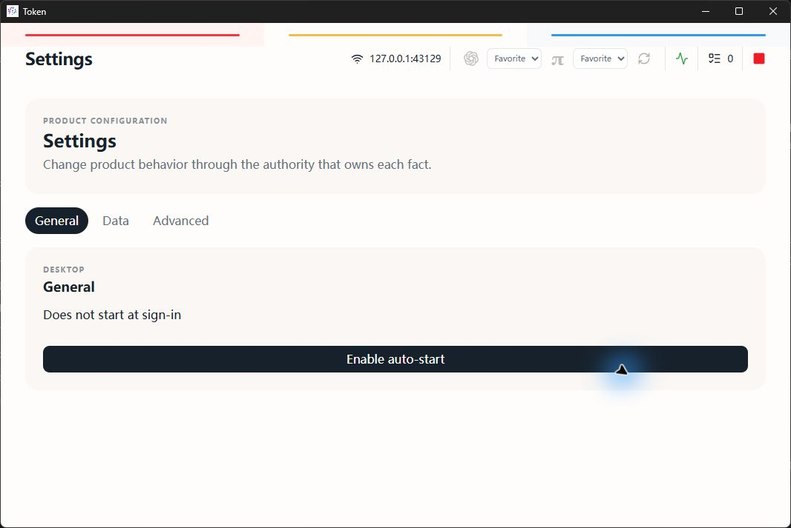
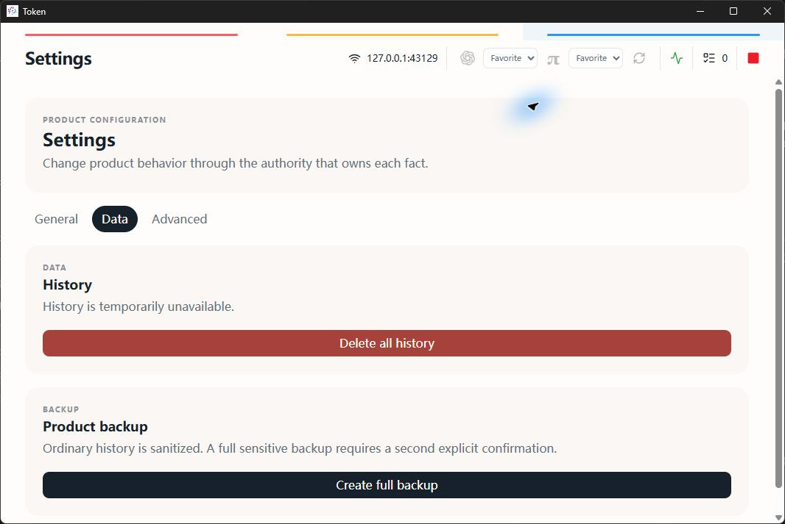
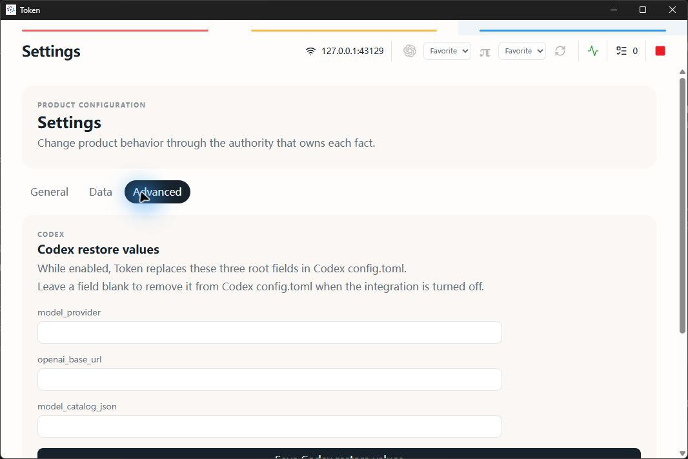
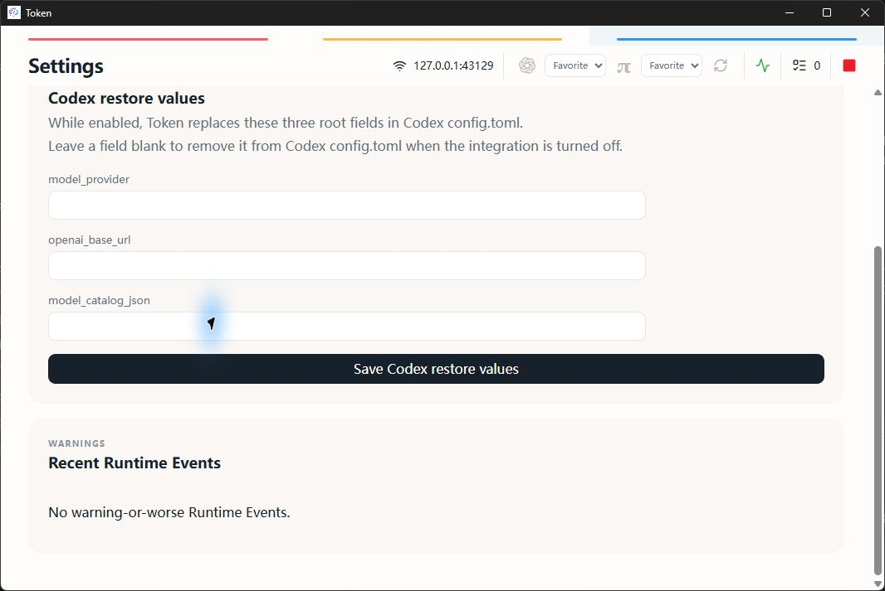
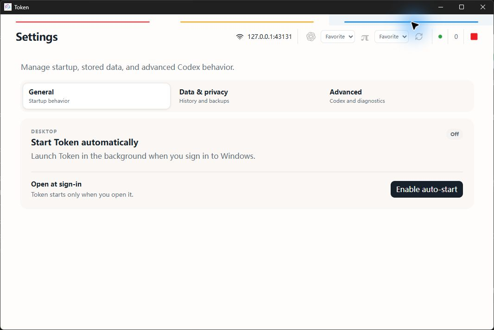
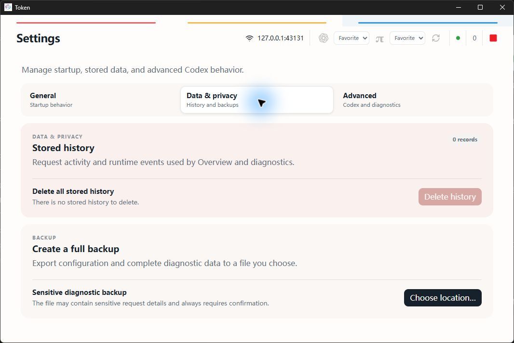
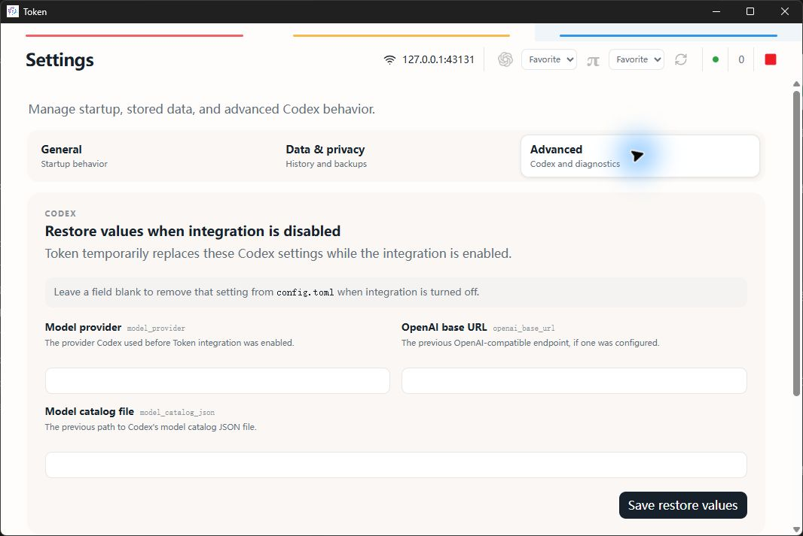
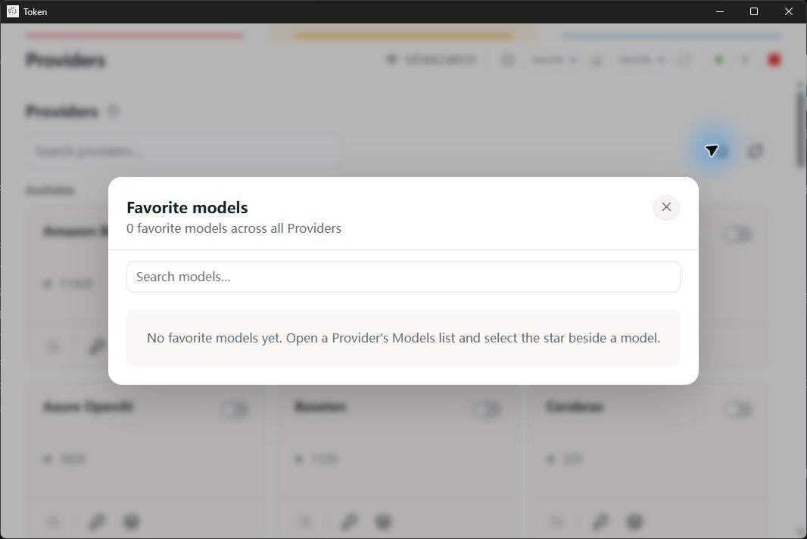
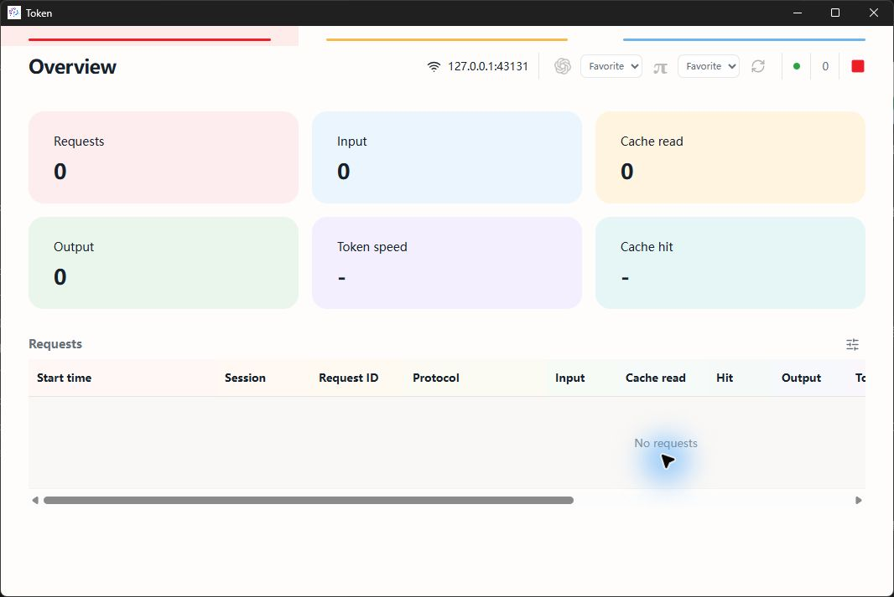

# Token Settings UI audit

Date: 2026-08-24

## Scope and goal

This audit covers the General, Data, and Advanced Settings surfaces at a 1066 × 713 desktop viewport. The user goal is to understand current state, find the relevant setting quickly, and distinguish routine actions from destructive or advanced actions.

## Before

1. **General — needs attention.** The page repeated the Settings title, used internal product-language copy, and stretched one auto-start action across the full card. The current state and the action were not visually paired.

   

2. **Data — needs attention.** History availability, deletion, backup sensitivity, and confirmations shared the same card treatment. Full-width buttons made destructive and routine actions look equally important.

   

3. **Advanced — needs attention.** Raw snake-case keys were the primary labels. Restore behavior and runtime warnings appeared at the same hierarchy level without enough explanation.

   

   

## After

4. **General — healthy.** One compact navigation row identifies the three settings groups. Auto-start has an explicit On/Off status and a right-aligned action beside a plain-language explanation.

   

5. **Data and privacy — healthy.** Stored history and backup are separate tasks. Destructive deletion is visually contained, disabled when there is nothing to delete, and explained before confirmation.

   

6. **Advanced — healthy.** Human-readable field names lead; exact Codex keys remain available as secondary technical context. Restore values and recent warnings are separate sections.

   

7. **Favorite models — healthy.** The Provider toolbar exposes one star entry for favorite models across every Provider, with a clear empty state and search.

   

8. **Runtime toolbar — healthy.** Running is represented by one green status dot, while active requests use a separate plain numeric value. The stop action remains distinct.

   

## Accessibility evidence and limits

The captured accessibility tree confirms a named tab list with three tab panels, native buttons, explicit status text, and descriptive labels for the runtime state, active-request count, Settings actions, and favorite-model entry. Screenshots support hierarchy, target-size, and visible-state review only. Full keyboard traversal, screen-reader announcements, zoom reflow, and measured contrast still require dedicated automated or assistive-technology testing.
